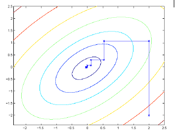
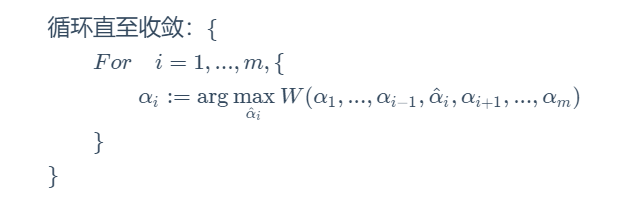

## 坐标上升  Coordinate Ascent

### 定义

对于优化问题
$$
\max _{\alpha} W\left(\alpha_{1}, \alpha_{2}, \ldots, \alpha_{m}\right)
$$
坐标上升的思想为，每次优化特定的$\alpha$ 而把其他参数固定，轮流优化特定参数直至收敛。

#### 最简单的坐标上升

#### 其他坐标上升思想

按照其他顺序优化参数，预测哪个参数对$W$的影响最大

