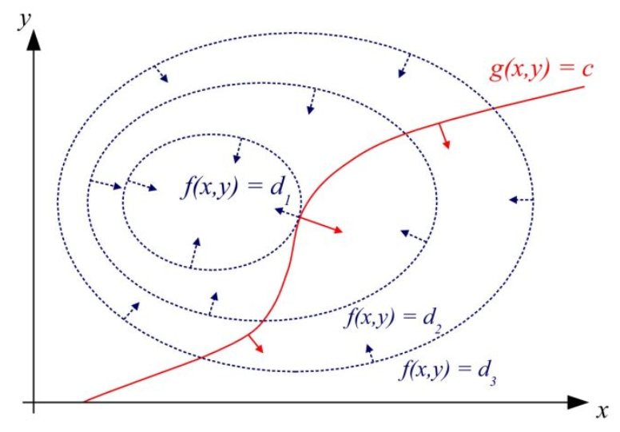
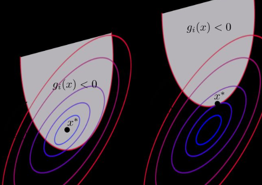

## 5拉格朗日乘子法 Lagrange multipliers

### 定义

寻找多元函数在一组约束下的极值的方法

将由d个变量与k个约束条件的最优化问题转化为具有$n+k$个变量的无约束优化问题。

### 原始问题

$f(x), $  $g(x)$, $h(x)$ 为定义在$R^d$ 上的连续可微函数。

求解如下约束问题：

#### 等式约束

$$
\begin{aligned}
{\min _{\boldsymbol{x}}}& {f(\boldsymbol{x})} \\ 
\text { s.t. } & h_{i}(\boldsymbol{x})=0 \quad(i=1, \ldots, k) 
\end{aligned}
$$

#### 不等式约束

$$
\begin{aligned}
{\min _{\boldsymbol{x}}}& {f(\boldsymbol{x})} \\ 
\text { s.t. } & h_{i}(\boldsymbol{x})=0 \quad(i=1, \ldots, m) \\ & g_{j}(\boldsymbol{x}) \leqslant 0 \quad(j=1, \ldots, n)
\end{aligned}
$$

### 拉格朗日函数

#### 等式约束 梯度条件 拉格朗日乘子

考虑等式约束，目标为在约束曲面$h_i(x)=0$上找到最小化目标函数$f(x)$的点，有：

- 约束曲面上的任一点，梯度$\nabla h(\boldsymbol{x})$ 正交与约束曲面
- 在最优点，目标函数和约束曲面相切，此时目标函数的梯度$\nabla f\left(\boldsymbol{x}^{*}\right)$ 也正交于约束曲面

即在最优点$\nabla h(\boldsymbol{x})$ 和$\nabla f(\boldsymbol{x})$的方向平行。

 即满足 ：
$$
\nabla f\left(\boldsymbol{x}^{*}\right)+\lambda \nabla h\left(\boldsymbol{x}^{*}\right)=0
$$
$\lambda\neq0$称为**拉格朗日乘子**。

此时使用条件：
$$
\left\{\begin{array}{l}{\nabla f\left(\boldsymbol{x}^{*}\right)+\lambda \nabla h\left(\boldsymbol{x}^{*}\right)=0} \\ {h(\boldsymbol{x}^*)=0}\end{array}\right.
$$
即可得到答案。

#### 拉格朗日函数

将以上方程表示为一个目标函数的最优化，定义**拉格朗日函数**：
$$
L(\boldsymbol{x}, \lambda)=f(\boldsymbol{x})+\lambda h(\boldsymbol{x})
$$
由于
$$
\left\{\begin{array}{l}
{\nabla_{\boldsymbol{x}} L(\boldsymbol{x}, \lambda)=\nabla f\left(\boldsymbol{x}^{*}\right)+\lambda \nabla h\left(\boldsymbol{x}^{*}\right)=0} \\ {\nabla_{\lambda} L(\boldsymbol{x}, \lambda)=h(\boldsymbol{x}^*)=0}
\end{array}\right.
$$
即把方程转为求拉格朗日函数的无约束最优化问题。

#### 不等式约束 KKT条件

$$
\begin{aligned}
{\min _{\boldsymbol{x}}}& {f(\boldsymbol{x})} \\ 
\text { s.t. } & g_{j}(\boldsymbol{x}) \leqslant 0 \quad(j=1, \ldots, n)
\end{aligned}
$$

- 当最优点在$g(x)<0$约束曲面内部取到，则拉格朗日函数退化为：

$$
L(\boldsymbol{x}, 0)=f(\boldsymbol{x})
$$

即在$\lambda = 0 $时优化拉格朗日函数，且满足$g(x)<0$。此时$\lambda \nabla g\left(x^{*}\right)=0$。

- 当最优点在约束曲面上$g(x)=0$，（此时$\lambda \nabla g\left(x^{*}\right)=0$ ）。

  此时$\nabla f\left(x^{*}\right)$方向一定与 $\nabla g\left(x^{*}\right)$ 相反，$\lambda \geq 0$。

所以在解拉格朗日函数的极值时还需要满足一下条件：
$$
\left\{\begin{array}{l}{g(x) \leqslant 0} \\ {\lambda \geqslant 0} \\ {\lambda g(x)=0}
\\h(x)=0\end{array}\right.
$$
该条件为**KKT条件**。

注意KKT条件是将优化拉格朗日函数和优化原函数等价的条件，拉格朗日函数本身没有条件。

#### 多个约束情况

$$
\begin{aligned}
{\min _{\boldsymbol{x}}}& {f(\boldsymbol{x})} \\ 
\text { s.t. } & h_{i}(\boldsymbol{x})=0 \quad(i=1, \ldots, m) \\ & g_{j}(\boldsymbol{x}) \leqslant 0 \quad(j=1, \ldots, n)
\end{aligned}
$$

拉格朗日函数为：
$$
L(\boldsymbol{x}, \boldsymbol{\lambda}, \boldsymbol{\mu})=f(\boldsymbol{x})+\sum_{i=1}^{m} \lambda_{i} h_{i}(\boldsymbol{x})+\sum_{j=1}^{n} \mu_{j} g_{j}(\boldsymbol{x})
$$
KKT条件为：
$$
\left\{\begin{array}{l}{g_{j}(\boldsymbol{x}) \leqslant 0} \\ {\mu_{j} \geqslant 0} \\ {\mu_{j} g_{j}(\boldsymbol{x})=0}\\
h_{i}(\boldsymbol{x})=0\end{array}\right.
$$

### 对偶问题

#### 主问题(primal problem)的极小极大表述

目标函数可以用拉格朗日函数在固定$x$，且满足原始约束的条件下的极大优化表述 P 为 primal
$$
\begin{aligned}
f(x)&=\max _{\lambda,\mu ;\mu\geq0}L(\boldsymbol{x}, \boldsymbol{\lambda}, \boldsymbol{\mu})\\
&=\max _{\lambda,\mu ;\mu\geq0}f(\boldsymbol{x})+\sum_{i=1}^{m} \lambda_{i} h_{i}(\boldsymbol{x})+\sum_{j=1}^{n} \mu_{j} g_{j}(\boldsymbol{x})\\
&=\theta_P(x)
\end{aligned}
$$
可以推导出如果不满足
$$
\left\{\begin{array}{l}{g_{j}(\boldsymbol{x}) \leqslant 0} \\
h_{i}(\boldsymbol{x})=0\end{array}\right.
$$
那么$L$的最大值将趋于无穷

当满足条件时，$L=f(x)$

即
$$
\theta_{p}(x)=\left\{\begin{array}{l}{f(x)} & 满足原始约束\\ {+\infty} &其他\end{array}\right.
$$
所以原始问题可以表述为：
$$
\min _{x}f(x)=\min _{x}\max _{\lambda,\mu ;\mu\geq0}L(\boldsymbol{x}, \boldsymbol{\lambda}, \boldsymbol{\mu})
=\min _{x}\theta_P(x)
=p^*
$$
称为**拉格朗日函数的极小极大问题**。

#### 对偶问题(dual problem)  极大极小问题

##### 对偶函数 dual function

定义对偶函数 D 为 dual 
$$
\theta_D(\lambda,\mu)=\min _{x}L(x,\lambda,\mu)
$$
对偶函数的形式可以将拉格朗日函数对$x$求偏导 $\dfrac{\partial L}{\partial x}$得到。
$$
\theta_D(\lambda,\mu)=L(x,\lambda,\mu)|_{\frac{\partial L}{\partial x}=0}
$$
有：
$$
\theta_D(\lambda,\mu)=\min _{x}L(x,\lambda,\mu)\leq L(x,\lambda,\mu)\leq\max _{\lambda,\mu ;\mu\geq0}L(\boldsymbol{x}, \boldsymbol{\lambda}, \boldsymbol{\mu})=\theta_P(x)=f(x)
$$
由于对偶函数始终小于原函数，即：
$$
\max _{\lambda,\mu ;\mu\geq0} \theta_{D}(\lambda, \mu) \leqslant \min _{x} \theta_{P}(x) =\min _{x}( f(x)|_{满足原始约束})
$$
不等式右边即为主问题的解

考虑不等式左边可以多接近主问题的解，即求：
$$
\max _{\lambda,\mu ;\mu\geq0} \theta_{D}(\lambda, \mu)=\max _{\lambda,\mu ;\mu\geq0} \min_{x}L(x,\lambda,\mu)=d^*
$$
该问题称为**拉格朗日函数的极大极小问题**。

#### 对偶性及条件

如果$d^*<p^*$ 称为弱对偶性。

如果$d^*=p^*$ 称为强对偶性。

##### 凸函数

当 有一个海森矩阵(Hessian matrix)的时候，那么当且仅当这个海森矩阵(Hessian matrix)是半正定矩阵，才是凸的

- 所有的线性linear（以及仿射affine）函数也都是凸的

##### 仿射函数

仿射(Affine)的意思大概就跟线性 linear 差不多，不同的就是在矩阵进行了线性变换的基础上还增加了一个截距项

##### Slater条件

如果满足以下条件(Slater条件)，则强对偶性成立：

- 主问题为凸优化问题，即$f(x)$和$g(x)$均为凸函数，$h(x)$为仿射函数时，
- 可行域中至少有一点$x$满足 对于所有$i$ 有$h_i(x)<0$ 

#### 使用对偶问题求解原问题

若强对偶性成立，则如果原问题的解为$x^*$，对偶问题的解为$\lambda^*,\mu^*$ 则
$$
p^{*}=d^{*}=L\left(x^{*}, \lambda^{*}, \mu^{*}\right)
$$
此时解一下方程：
$$
\begin{array}{l}{\nabla_{x} L\left(x ; \lambda^{*}, \mu^{*}\right)=0} \\ {\nabla_{\lambda} L\left(x^{*}, \lambda^{*}, \mu^{*}\right)=0} \\ {\nabla_{\mu} L\left(x^{*}, \lambda^{*}, \mu^{*}\right)=0}\end{array}
$$
即可得到原问题和对偶问题的解。

### 总结

使用拉格朗日乘子法的两种方法。

#### 方法一

将原问题转为KKT条件下，拉格朗日函数的优化问题，即优化：
$$
L(\boldsymbol{x}, \boldsymbol{\lambda}, \boldsymbol{\mu})=f(\boldsymbol{x})+\sum_{i=1}^{m} \lambda_{i} h_{i}(\boldsymbol{x})+\sum_{j=1}^{n} \mu_{j} g_{j}(\boldsymbol{x})
$$
且：
$$
\left\{\begin{array}{l}{g_{j}(\boldsymbol{x}) \leqslant 0} \\ {\mu_{j} \geqslant 0} \\ {\mu_{j} g_{j}(\boldsymbol{x})=0} \\ {h_{i}(\boldsymbol{x})=0}\end{array}\right.
$$

#### 方法二

如果原问题满足Slater条件：

- 主问题为凸优化问题，即$f(x)$和$g(x)$均为凸函数，$h(x)$为仿射函数时，
- 可行域中至少有一点$x$满足 对于所有$i$ 有$h_i(x)<0$ 

则可以把原问题转为对偶问题求解，具体解如下方程：
$$
\begin{array}{l}{\nabla_{x} L\left(x ; \lambda^{*}, \mu^{*}\right)=0} \\ {\nabla_{\lambda} L\left(x^{*}, \lambda^{*}, \mu^{*}\right)=0} \\ {\nabla_{\mu} L\left(x^{*}, \lambda^{*}, \mu^{*}\right)=0}\end{array}
$$

当原问题满足Slater条件时

- 存在$x^*, \lambda^*,\mu^*$满足KKT条件，那么$x^*, \lambda^*,\mu^*$是原问题和对偶问题的解

- 如果$x^*, \lambda^*,\mu^*$是原问题和对偶问题的解，那么$x^*, \lambda^*,\mu^*$满足KKT条件