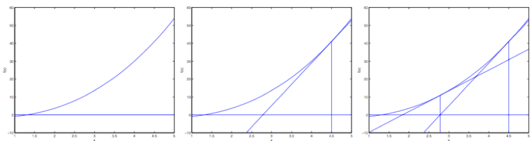
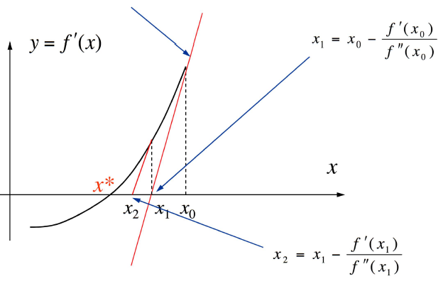

### 求零点的牛顿法

每次对自变量进行更新：
$$
\theta^{t+1} :=\theta^{t}-\frac{f\left(\theta^{t}\right)}{f^{\prime}\left(\theta^{t}\right)}
$$

#### 图示

#### 解释

用一个线性函数来对函数进行逼近，线性函数为在该点的切线，之后继续在下一个猜测点逼近。

### 求极值的牛顿法

求极值即求函数的导函数的零点，即：
$$
\arg \min f(\theta) \Longleftrightarrow \text { solve } : \nabla f(\theta)=0
$$
所以，对导函数使用牛顿法：
$$
\theta^{t+1} :=\theta^{t}-\frac{f^\prime\left(\theta^{t}\right)}{f^{\prime\prime}\left(\theta^{t}\right)}
$$

#### 图示

过初始点作导函数的切线$y=f^{\prime}\left(x_{0}\right)+f^{\prime \prime}\left(x_{0}\right)\left(x-x_{0}\right)$，和坐标轴交于$x_1$

 

### 牛顿-拉普森法 Newton-Raphson method

- 牛顿法的向量扩展
- 在初始点对原函数进行二次近似，即二阶泰勒展开

$$
\phi(x)=f\left(x^{(k)}\right)+\nabla f\left(x^{(k)}\right)\left(x-x^{(k)}\right)+\frac{1}{2} \nabla^{2} f\left(x^{(k)}\right)\left(x-x^{(k)}\right)^{2} \approx f(x)
$$

$$
\begin{aligned}
\phi(x) &= f\left(x^{(k)}\right)
+\nabla f\left(x^{(k)}\right)x -\nabla f\left(x^{(k)}\right)x^{(k)}
+\frac{1}{2} \nabla^{2} f\left(x^{(k)}\right)\left(x^2-2x^{(k)}x + (x^{(k)})^2\right) \\
\nabla{\phi(x)} &= \nabla f\left(x^{(k)}\right)+ \nabla^{2} f\left(x^{(k)}\right)x-\nabla^{2} f\left(x^{(k)}\right)x^{(k)}=0
\end{aligned}
$$

$$
x=x^{(k)}-\nabla^{2} f\left(x^{(k)}\right)^{-1} \nabla f\left(x^{(k)}\right)
$$

即：
$$
x^{(k+1)}=x^{(k)}-\nabla^{2} f\left(x^{(k)}\right)^{-1} \nabla f\left(x^{(k)}\right)
$$
写成向量形式
$$
\theta :=\theta-H^{-1} \nabla_{\theta} f(\theta)
$$
其中 $ H^{-1}\Longleftrightarrow\nabla^{2} f\left(x^{(k)}\right)^{-1}$    $\nabla_{\theta} f(\theta)\Longleftrightarrow  \nabla f\left(x^{(k)}\right)$ 

$\nabla_{\theta} f(\theta)$ 向量为每一项的偏导

$H$称为Hessian矩阵，包含截距项时为$(n+1)\times(n+1)$矩阵，每一项的具体值为：
$$
H_{i j}=\frac{\partial^{2} f(\theta)}{\partial \theta_{i} \partial \theta_{j}}
$$
