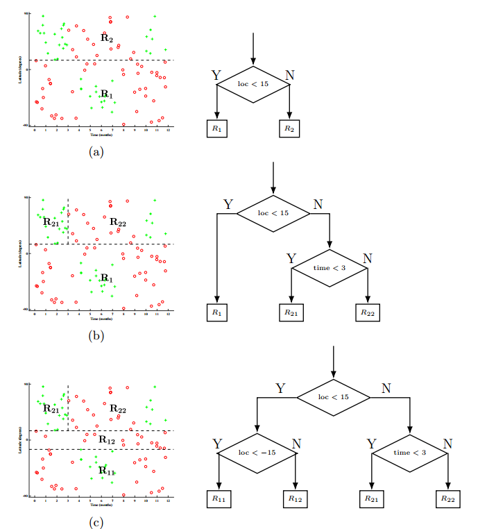

## 分类回归树 CART 

### 定义

分类回归树 Classification And Regression Tree 

同样由特征选择，生成树，剪枝组成

可以用于分类和回归。

给定随机变量$X$的条件下，输出随机变量$Y$的条件分布。

假设决策树为二叉树，特征取值仅为 是和否

### 决策树生成

#### 回归树生成

标签$Y$为连续变量时，使用CART进行回归。

使用平方误差最小化准则。

当将输入空间划分为$M$个单元 $R_1,R_2, ..., R_M$，对于每一个单元，给定一个输出值$c_M$，则回归树的输出为：
$$
f(x)=\sum_{m=1}^{M} c_{m} I\left(x \in R_{m}\right)
$$
当使用平方误差损失函数$\sum_{x_{i} \in R_{m}}\left(y_{i}-f\left(x_{i}\right)\right)^{2}$来优化输出，可以知道当划分确定时，最优值$c_m^*$为单元$R_m$上所有输入实例对应输出$y_i$的平均值：
$$
\hat{c}_{m}=\operatorname{ave}\left(y_{i} | x_{i} \in R_{m}\right)
$$

##### 划分方法

被称为最小二乘回归树生成方法。

对于第$j$个特征$X_j$ ，给定一个阈值$s$，将输入空间分成两部分：

（其中$X_j $称为切分变量 splitting variable 阈值$s $称为切分点）
$$
R_{1}(j, s)=\{x | x_j \leqslant s\}
$$
和
$$
R_{2}(j, s)=\{x | x_j>s\}
$$

对于这两部分$R_1$和$R_2$，分别指定输出值$c_i$ ,并对于固定的$c_i​$ ，对它们进行损失函数最小化。

对$R_1$，若采用平方损失，有：
$$
L_{c}^*(R_1)=\arg\min_{c_1} L_c(R_1)=\arg\min_{c_1} \sum_{x \in R_{1}(j, s)}\left(y^{(i)}-c_{1}\right)^{2}
$$
对两项求和，得到关于选取特征$X^{(j)}$和阈值$s$的损失函数：
$$
L_{j,s}=L^*_{c}(R_1)+L^*_c(R_2)=\arg\min_{c_1} L_c(R_1)+\arg\min_{c_2} L_c(R_2)
$$
取平方误差时，有
$$
\begin{aligned}
L_{j,s}&=\arg\min_{c_1} L_c(R_1)+\arg\min_{c_2} L_c(R_2)\\
&=\arg\min_{c_1} \sum_{x \in R_{1}(j, s)}\left(y^{(i)}-c_{1}\right)^{2} + \arg\min_{c_2} \sum_{x \in R_{1}(j, s)}\left(y^{(i)}-c_{2}\right)^{2}\\
&=\sum_{x \in R_{1}(j, s)}\left(y^{(i)}-\hat{c_{1}}\right)^{2} +
\sum_{x \in R_{2}(j, s)}\left(y^{(i)}-\hat{c_{2}}\right)^{2}

\end{aligned}
$$
其中
$$
\hat{c}_{k}=\operatorname{ave}\left(y^{(i)} | x^{(i)} \in R_{k}(j, s)\right)
$$
对于$L_{j,s}$通过遍历特征$j$和阈值$s$，找到使得损失最小的二元组 $(j^*,s^*)$

$$
L^*_{j,s}=\arg\min_{j,s}L_{j,s}=\arg\min_{j,s}[\sum_{x \in R_{1}(j, s)}\left(y^{(i)}-\hat{c_{1}}\right)^{2} +
\sum_{x \in R_{2}(j, s)}\left(y^{(i)}-\hat{c_{2}}\right)^{2}]
$$

 此时$(j^*,s^*)$ 将原区域分成两个区域，选择这个划分作为子区域。

分别对子区域$R_1,R_2$继续调用算法，直到满足停止条件。

#### 分类树的生成

> 基尼系数部分见 决策树.md

1. 对数据集$D$中的每个特征$A$和特征的每个取值$x^{(A)}=a$ ，将数据集分成$x^{(A)}=a$和$x^{(A)}\neq a$两部分，分别计算基尼指数$\operatorname{Gini}(D, A=a)$ 
2. 在这所有的划分中，选择基尼指数最小的划分（特征+分割点），将数据集$D$分成两部分（树的两个结点）
3. 对这两部分（结点）分别调用（1）（2），直到满足停止条件之一：
   1. 结点中样本数小于某个阈值
   2. 样本集的基尼指数小于某个阈值

### 决策树剪枝

在生成后，生成的数为$T_0 ​$

#### 损失函数

定义一棵子树的损失函数为：

$$
C_{\alpha}(T)=C(T)+\alpha|T|
$$
$C(T)$为预测误差，可以取子树的基尼系数。$|T|$为子树的叶节点数衡量的子树的复杂性，$\alpha$ 衡量了损失函数重视的方面。

对于一个确定的$\alpha$ ，存在一棵子树$T_a$，使得$C_a(T)$最小。

- $\alpha$越大，最优子树越小
- $\alpha=0$ 最优子树为原树$T_0$ 
- $\alpha \rightarrow \infty$ 最优子树为单个根结点组成的树

可以证明，随着$\alpha​$的变化产生的最优子树序列$\left\{T_{0}, T_{1}, \cdots, T_{n}\right\}​$是嵌套的，相互成包含关系，即均包含根结点。

#### 选取结点剪枝

考虑选取树中某个内部结点$t$，把它的子结点全部删掉，完成一次剪枝。

当剪枝前损失函数和剪枝后损失函数相同时，由于剪枝后结点更少，所以更倾向于剪枝。

当比较剪枝前后的损失函数时，由于只要考虑它们的差值，不需要考虑决策树整体的损失，而只考虑从该节点以下的子树的损失函数，由于其他部分的损失函数在剪枝前后是相同的。

剪枝前该子树的损失：
$$
C_{\alpha}\left(T_{t}\right)=C\left(T_{t}\right)+\alpha\left|T_{t}\right|
$$
$T_t$是以结点$t$为根结点的子树。

剪枝后该子树的损失，由于只剩一个结点$t$，如下：
$$
C_{\alpha}(t)=C(t)+\alpha \times1
$$
对每个结点$t$，总能找到一个$\alpha$使得在剪枝前后损失函数相同：

$$
\alpha=\frac{C(t)-C\left(T_{t}\right)}{\left|T_{t}\right|-1}=g(t)
$$
表示了剪枝后整体损失函数的减少程度。

#### 算法

输入 $T=T_0$

1. 对于输入的决策树，从下到上计算每个结点$t$的$g(t)=\alpha$，从中选择$g(t)$最小的结点$t$
2.  对该节点进行剪枝，该节点的分类标签为属于该节点的样本中样本数最多的分类。
3. 对剪枝后的数继续剪枝，使得每次的$\alpha$递增。
4. 直到剩下只剩根结点和两个子结点组成的树
5. 对得到的子树序列$\left\{T_{0}, T_{1}, \cdots, T_{n}\right\}$ 通过交叉验证选取最优子树，同时桶里的验证数据集，检测子树序列的平方误差或者基尼系数，选取平方误差/基尼系数最小的决策树。

