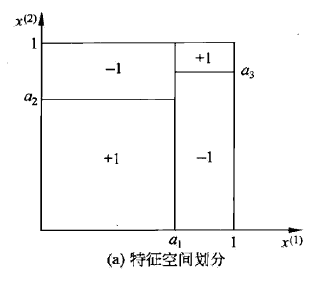
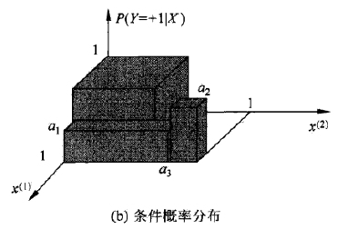
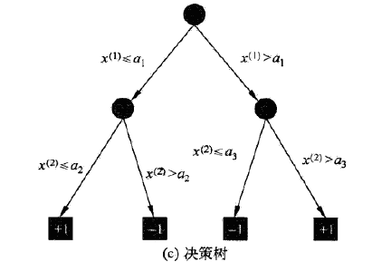
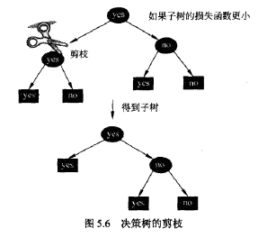

## 决策树 Decision Tree

### 定义

一种描述对实例进行分类的树形结构

- 由结点node和有向边directed edge组成 
- 结点分为内部节点和叶节点 
  - 内部节点表示一个特征和属性
  - 叶节点表示一个类

#### 性质

##### if-then规则的集合

- 根结点到叶节点的每条路径构建一条规则
- 路径上内部节点的特征对应着规则的条件
- 叶节点的类对应着规则的结论
- 决策树的路径之间**<u>互斥且完备</u>**
  - 每个实例都被且只被一条路径/规则覆盖

##### 定义在特征空间和类空间上的条件概率分布$P(Y|X)$

- 条件概率分布定义在特征空间$X$的一个划分上，每一条规则代表着一个区域

- $P(Y|X)$即在区域给定的条件下的类的条件分布

- 对于这样的划分，决策树将实例$X$分到$P(Y|X)​$ 大的那个类中

- 决策树为

  

#### 优点

可读性 分类速度快 

#### 训练

- 特征选择
- 决策树的生成
- 决策树的修建

#### 分类

从根结点开始 对实例的每个特征进行测试，根据测试结构将实例分配到子结点（每个子结点对应着该特征的一个取值），如此递归，直至达到叶节点。

---

### 决策树的学习

本质是从训练数据中归纳出分类规则

与训练集不相矛盾的决策树可以有多个，也可以一个没有

目标：找到一个与训练集矛盾最小，同时泛化能力强的决策树

---

### 特征选择 

如果特征过多，对特征进行选择，只留下对训练瞬狙有足够分类能力的特征。

如果按照一个特征将训练数据分隔成自己，使得各个子集在当前条件下有最好分类，则应当选择这个特征。

#### 信息增益

使用信息增益 information gain 来表示这种特征的显著性。

假设$|D|$为样本容量，$|D_k|$为类$C_k$的样本个数，$|D_i|$为特征$A\{a_1,a_2,...,a_n \}$中取值为$a_i$的样本个数，类似有$D_{ik}$。

##### 熵

对离散分布$P(X=x_i)=p_i$，熵定义为：
$$
H(X)=-\sum_{i=1}^{n} p_{i} \log p_{i}=H(p)
$$

> 之后关于熵的部分见，数学/熵.md

##### 信息增益

特征$A​$对训练数据集$D​$的信息增益$g(D,A)​$ 定义为训练数据集中类与特征的互信息。
$$
g(D, A)=I(D;A)=H(D)-H(D | A)
$$

可以认为是在给定特征$A$的条件下，对数据$D$分类不确定性的降低。

注意这里的熵为经验熵，一般由极大似然估计得到。

经验熵计算如下：
$$
P(C_k)=\dfrac{|C_k|}{|D|}\\
H(D)=-\sum_{k=1}^{K} \frac{\left|C_{k}\right|}{|D|} \log _{2} \frac{\left|C_{k}\right|}{|D|}
$$
经验条件熵：
$$
H(D | A)=\sum_{i=1}^{n} \frac{\left|D_{i}\right|}{|D|} H\left(D_{i}\right)=-\sum_{i=1}^{n} \frac{\left|D_{i}\right|}{D| } \sum_{k=1}^{K} \frac{\left|D_{i k}\right|}{\left|D_{i}\right|} \log _{2} \frac{\left|D_{k}\right|}{\left|D_{i}\right|}
$$

##### 基于信息增益的特征选择

对训练数据集，计算其每个特征的信息增益，选择信息增益最大的特征。

---

#### 增益率 增益比

使用信息增益选择特征，存在偏向于选择取值较多的特征的问题。

使用信息增益比$g_R$，对这个问题进行校正。

定义为信息增益与训练数据集关于特征$A$的值的熵之比
$$
g_{R}(D, A)=\frac{g(D, A)}{H_A(D)}
$$
其中训练数据集关于特征$A$的值的熵：
$$
H_A(D)=-\sum_{i=1}^{n}\dfrac{|D_i|}{|D|}\log_2\dfrac{|D_i|}{|D|}
$$

---

#### 基尼系数

假设分布中有$K$个类，样本点属于第$k$类的概率为$p_k$，则概率分布的基尼系数为：
$$
\operatorname{Gini}(p)=\sum_{k=1}^{K} p_{k}\left(1-p_{k}\right)=1-\sum_{k=1}^{K} p_{k}^{2}
$$
二分类问题下：
$$
\operatorname{Gini}(p)=2 p(1-p)
$$
对于样本集，基尼系数为：
$$
\operatorname{Gini}(D)=1-\sum_{k=1}^{K}\left(\frac{\left|C_{k}\right|}{|D|}\right)^{2}
$$

样本集$D​$根据特征$A​$是否去某值$a​$分为两部分$D_1,D_2​$
$$
D_{1}=\{(x, y) \in D | x^{(A)}=a\} \\
D_{2}=\{(x, y) \in D | x^{(A)}\neq a\}
$$
特征$A$下的基尼指数定义为
$$
\operatorname{Gini}(D, A)=\frac{\left|D_{1}\right|}{|D|} \operatorname{Gini}\left(D_{1}\right)+\frac{\left|D_{2}\right|}{|D|} \operatorname{Gini}\left(D_{2}\right)
$$
$\operatorname{Gini}(D)$表示$D$的不确定性，$\operatorname{Gini}(D, A)$表示分割后的不确定性，基尼指数越大，不确定性越大。

---

### 生成方法

在所有可能的决策树中选取最优决策树是NP完全问题，所以通常使用启发式方法。

递归选在最有特征，根据该特征对训练数据进行分割，使得对各个子数据集有一个最好分类。

- 将所有数据放在根结点
- 选择最优特征，按照这个特征将训练数据分割成子集，使得各个自己有在当前条件下的最好分类
  - 如果已经正确分类，则构建叶节点，将该类放到该叶节点上（注意，<u>**类可以不只放到一个叶节点上**</u>）
  - 如果子集中仍然又不止一类，再在该子集上选择最优特征，继续分割子集
- 循环直到所有实例被基本正确分类，或者没有合适的特征，此时每个结点都在叶节点上

### 剪枝 Pruning

决策树容易发生过拟合现象，需要在生成的决策树上进行剪枝，提高泛化能力。

对已生成的树进行简化的过程称为剪枝。

通过极小化决策树整体的损失函数实现。

利用损失函数最小剪枝等于用正则化的极大似然估计进行模型选择。

### 损失函数

通常是正则化的极大似然函数。

参数：

- $|T|$决策树的叶节点数
-  $t$为其中一个叶节点，$N_t$为叶节点中样本数
- $N_{ik}$为叶节点中第$k$类的样本数
- $\alpha$ 正则化系数

损失函数定义为：
$$
C_{\alpha}(T)=\sum_{t=1}^{|T|} N_{t} H_{t}(T)+\alpha|T|
$$
其中$H_t(T)$为叶节点上的经验熵，有
$$
H_{t}(T)=-\sum_{k} \frac{N_{t k}}{N_{t}} \log \frac{N_{t k}}{N_{t}}
$$
设定预测误差$C(T)$为：
$$
C(T)=\sum_{i=1}^{|T|} N_{t} H_{t}(T)=-\sum_{i=1}^{|T|} \sum_{k=1}^{K} N_{i k} \log \frac{N_{i k}}{N_{t}}
$$
则损失函数为：
$$
C_{\alpha}(T)=C(T)+\alpha|T|
$$

### 算法

输入：生成算法得到的决策树$T$，参数$\alpha$

输出：剪枝后的决策树

找到某个结点的叶节点，使得回缩以后的损失函数小于回缩之前的损失函数，则使这组叶节点回缩，直到不存在这样的叶节点。

