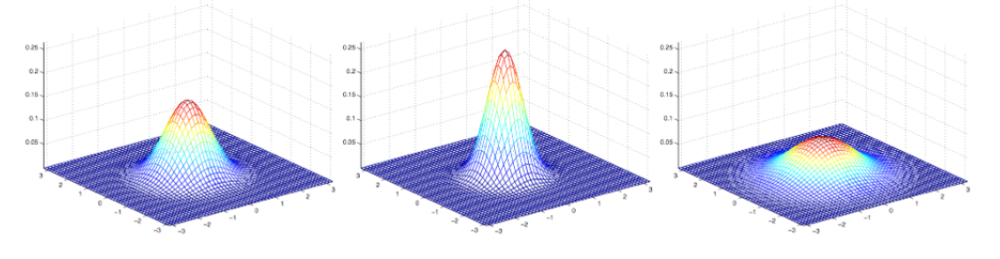
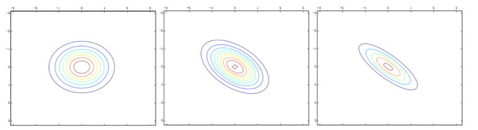

## 多元正态分布 Multivariate Normal Distribution

### 密度函数定义

$X\sim N(\mu, \Sigma)$
$$
p(x ; \mu, \Sigma)=\frac{1}{(2 \pi)^{n / 2}|\Sigma|^{1 / 2}} \exp \left(-\frac{1}{2}(x-\mu)^{T} \Sigma^{-1}(x-\mu)\right)
$$

### 参数

- 均值向量$\mu \in R^{n}$
  $$
  E[X]=\int_{x} x p(x ; \mu, \Sigma) d x=\mu
  $$

- 协方差矩阵 $\Sigma \in R^{n \times n}$

$\Sigma \geq 0$ ，是一个对称的，半正定矩阵

协方差矩阵的定义：
$$
\operatorname{Cov}(X)=E\left[(X-E[X])(X-E[X])^{T}\right]
$$
或：
$$
\operatorname{Cov}(X)=E\left[X X^{T}\right]-(E[X])(E[X])^{T}
$$

### 标准正态分布

均值为0，协方差矩阵为单位矩阵的高斯分布。

### 图例

- 方差越大形态越宽，方差越小分布更加集中。

- 若只有主对角线非零，则康托图为正圆，否则为椭圆。

