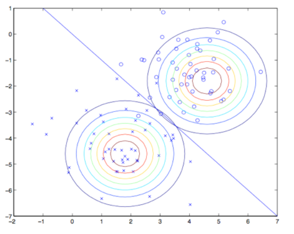
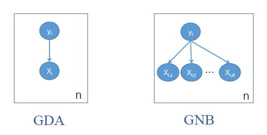

## 高斯判别分析 Gaussian Discriminant Analysis (GDA)

### 定义

对于连续随机变量进行分类。

做出如下假设：

- 假设$p(x|y)$为多元高斯分布（见多元高斯分布.md）。
- 假设$Y$服从伯努利分布。
- 高斯分布的方差在类间相同，均值在类间不同。

假设似然的分布为：
$$
p(x ; \mu, \Sigma)=\frac{1}{(2 \pi)^{n / 2}|\Sigma|^{1 / 2}} \exp \left(-\frac{1}{2}(x-\mu)^{T} \Sigma^{-1}(x-\mu)\right)
$$

#### 模型

$$
\begin{aligned}
y & \sim B e r n o u l l i(\phi) \\ 
x|y=0& \sim N\left(\mu_{o}, \Sigma\right) \\
x|y=1&  \sim N\left(\mu_{1}, \Sigma\right).
\end{aligned}
$$

即
$$
\begin{aligned} p(y) &=\phi^{y}(1-\phi)^{1-y} \\ p(x | y=0) &=\frac{1}{(2 \pi)^{n / 2}|\Sigma|^{1 / 2}} \exp \left(-\frac{1}{2}\left(x-\mu_{0}\right)^{T} \Sigma^{-1}\left(x-\mu_{0}\right)\right) \\ p(x | y=1) &=\frac{1}{(2 \pi)^{n / 2}|\Sigma|^{1 / 2}} \exp \left(-\frac{1}{2}\left(x-\mu_{1}\right)^{T} \Sigma^{-1}\left(x-\mu_{1}\right)\right) \end{aligned}
$$

#### 参数估计

使用最大似然估计，求$p(x,y)$的模型参数，使得当前样本集出现的概率（似然）最大。

而$p(x,y)=p(x|y)p(y)$

对上式取对数，得到对数似然（一共$m$个样本）：
$$
\begin{aligned} l\left(\phi, \mu_{0}, \mu_{1}, \Sigma\right) &=\log \prod_{i=1}^{m} p\left(x^{(i)}, y^{(i)} ; \phi, \mu_{0}, \mu_{1}, \Sigma\right) \\ &=\log \prod_{i=1}^{m} p\left(x^{(i)} | y^{(i)} ; \mu_{0}, \mu_{1}, \Sigma\right) p\left(y^{(i)} ; \phi\right) \end{aligned}
$$

##### 优化

对对数似然求导得到：
$$
\begin{aligned} 
\phi &=\frac{1}{m} \sum_{i=1}^{m} 1\left\{y^{(i)}=1\right\}  正例出现的频率\\
 \mu_{0} &=\frac{\sum_{i=1}^{m} 1\left\{y^{(i)}=0\right\} x^{(i)}}{\sum_{i=1}^{m} 1\left\{y^{(i)}=0\right\}} 反例样本的均值\\ 
 \mu_{1} &=\frac{\sum_{i=1}^{m} 1\left\{y^{(i)}=1\right\} x^{(i)}}{\sum_{i=1}^{m} 1\left\{y^{(i)}=1\right\}} 正例样本的均值\\ \Sigma &=\frac{1}{m} \sum_{i=1}^{m}\left(x^{(i)}-\mu_{y^{(i)}}\right)\left(x^{(i)}-\mu_{y^{(i)}}\right)^{T} 
\end{aligned}
$$
其中$1\left\{\right\}$ 或$\delta \left\{ \right\}$为指示函数，括号内为真时为1，否则为0。

$\mu_{y_{i}}$对应$\mu_0$或$\mu_1$     $y_i$为0或1 取决于样本

#### 图示

估计两个方差相同的高斯分布，可知决策面为直线。

#### 与GNB的区别

GNB假设每个$x_i$ 服从单变量的高斯分布，且相互独立。

GDA假设$X$本身服从多变量高斯分布。

GNB的假设条件强于GDA。

#### 与LR的相关性

部分见 高斯朴素贝叶斯.md

可以得知，如果$p(x|y)$ 时一个多变量高斯分布，且具有一个共享的协方差矩阵，那么$p(y|x)$ 一定符合一个logistic 函数
$$
p(y=1 | x ; \phi, \Sigma, \mu_{0}, \mu_{1})=\frac{1}{1+\exp \left(-\theta^{T} x\right)}
$$
反之不成立，有很多不同的假设集合都能够将$p(y|x)$引向逻辑回归函数，例如$x\left|y=0 \sim \operatorname{Poisson}\left(\lambda_{0}\right)\right.$ 和 $x\left|y=1 \sim \operatorname{Poisson}\left(\lambda_{1}\right)\right.$。

这表明高斯判别模型能比逻辑回归对数据进行**更强的建模和假设**，在**这两种模型假设都可用的时候**，GDA去拟合数据是更好的，是一个更好的模型。

当$p(x|y)$已经确定是一个高斯分布（有共享的协方差矩阵$\Sigma$），那么高斯判别分析是**渐进有效的（asymptotically efficient）**

在面对非常大的训练集（训练样本规模 $m$特别大）的时候，严格来说，可能就没有什么别的算法能比高斯判别分析更好

不过由于逻辑回归做出的假设要明显更弱一些，因此逻辑回归给出的判断鲁棒性（robust）也更强，同时也**对错误的建模假设**不那么敏感。

- 即GDA能够建立更强的模型假设，并且在数据利用上更加有效；前提是模型假设争取或者至少接近正确。

- LR假设更弱，因此对于偏离的模型假设来说更加鲁棒。
- 如果训练集数据的确是非高斯分布的，而且是有限的大规模数据，那么逻辑回归几乎总是比GDA要更好的。
- 在实际中，逻辑回归的使用频率要比GDA高得多。

