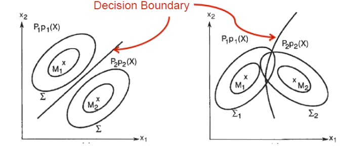

## 朴素贝叶斯分类器 Naive Bayes Classifier (NB)

### 离散贝叶斯分类器的学习参数量

对于$d$维的数据$X$，每个数据有$t$种选择，每个数据分为$K$类$Y$的问题：

- 学习先验$P(Y=y)$

学习 $P(Y=y_0),P(Y=y_1),P(Y=y_2), ... ,P(Y=y_{K-1})$一共$K-1$个参数（最后一个用1减即可）

- 学习似然 $P(X=x|Y=y)$

对于$Y=y_k$ 一共有$t^d$个数据对应，需要学习$t^d-1$个数据点的似然。
$$
P(X_0=x_{01},X_1=x_{11},...X_d=x_{d1}|Y=y_k) \\
P(X_0=x_{02},X_1=x_{11},...X_d=x_{d1}|Y=y_k) \\
...\\
P(X_0=x_{0t},X_1=x_{1t},...X_d=x_{dt}|Y=y_k)
$$
一共$\left(t^{d}-1\right) K$个参数需要学习。

### 条件独立假设

由于贝叶斯分类器需要学习的参数是指数级的，数量过多。为了减少学习参数，引入条件独立假设。

假设$X$的各个属性**在给定$Y$的条件**下独立，即：
$$
P(X_0=x_{0+},X_1=x_{1+},...X_d=x_{d+}|Y=y_k)\\
=P(X_0=x_{0+}|Y=y_k)P(X_1=x_{1+}|Y=y_k)...P(X_d=x_{d+}|Y=y_k) \\
=\prod_{i} P\left(X_{i} | Y=y_k\right)
$$
此时估计参数减少到$(t-1)dK$

### 参数估计

使用最大似然估计，选择参数
$$
\phi_{i |y=1}=p\left(x_{i}=1 | y=1\right)\\
\phi_{i| y=0}=p\left(x_{i}=1 | y=0\right)\\

\phi_{y}=p(y=1)
$$

使得已知数据点出现概率（似然最大）：
$$
P(x,y | \phi_{i |y=1},\phi_{i |y=0},\phi_{y})=\prod_{i} P(x^{(i)},y^{(i)})=\prod_{i}P(x^{(i)}|y^{(i)})P(y^{(i)})
$$

### 离散下的概率估计

> 西瓜书 P151

使用最大似然估计

#### 估计先验

使用$y_i$出现的频率估计，$\left|D_{y_i}\right|$ 为$y_i$在样本中出现次数：
$$
P(y_i)=\frac{\left|D_{y_i}\right|}{|D|}
$$

#### 估计似然

频率估计，$D_{c, x_{i}}$在$D_{y_i}$中第$i$个属性取值为$x_i$的样本组成的集合
$$
P\left(x_{i} | y_i\right)=\frac{\left|D_{c, x_{i}}\right|}{\left|D_{y_i}\right|}
$$

### 连续变量下估计

> 西瓜书 P151

在估计$P(y)$时和离散时相同，在估计似然$P(X_i|y_k)$时，当属性是连续随机变量时：

假设每个似然都服从高斯分布（单变量高斯），即：
$$
p\left(x_{i} | y_i\right) \sim \mathcal{N}\left(\mu_{k, i}, \sigma_{k, i}^{2}\right)
$$

$$
P\left(X_{i}=x | Y=y_{k}\right)=\frac{1}{\sigma_{i k} \sqrt{2 \pi}} e^{\frac{-\left(x-\mu_{i k}\right)^{2}}{2 \sigma_{i k}^{2}}}
$$

其中$\mu_{k, i}$ $\sigma_{k, i}$为$y_k$样k本中在第$i$个属性的均值和方差。

当$Y$有$K$个标签，一共有$d$个连续随机变量属性时，一共有$dK$个高斯分布需要估计。

- 有时假设均值 方差独立于 $Y$ 即对于每个标签 均值 方差相同（类间方差相同），每个属性方差不同（类内方差不同）

则只要求$\sigma_0 ... \sigma_d$ 一共$d$个高斯分布

- 有时假设均值 方差 独立于 $X_i$ 即每个属性均值 方差相同

要求 $\sigma_0, ..., \sigma_k$ 一共$K$个高斯分布

#### 与离散型混合

> 西瓜书 P151

当$X$中既有连续变量属性，又有离散变量属性，则离散变量用频率估计似然，连续变量用GNB估计似然，本质都是极大似然估计MLE，最后根据条件独立假设把所有似然连乘即可。

### 问题

#### 数据不符合条件独立假设

$$
P\left(X_{1}, \ldots, X_{d} | Y\right) \neq \prod_{i} P\left(X_{i} | Y\right)
$$

#### 样本不够

如果用数据点出现的频率作最大似然估计$P(X_i=x_i|Y_j)$，则当数据点在样本中不存在时会将其概率估计为0，一般不符合现实。

##### 解决方法 拉普拉斯平滑 Laplacian Smoothing

增加一个虚拟的数据点

> 西瓜书 P153
>
> 相当于在频率学派方法中的贝叶斯思想，加的数据点体现了先验的特征，随着数据增多影响逐渐减少。

$N$表示训练集中可能的类别数，$N_i$表示第$i$个属性可能的取值数

$$
\begin{aligned} \hat{P}(y_i) &=\frac{\left|D_{y_i}\right|+1}{|D|+N} \\ \hat{P}\left(x_{i} | y_i\right) &=\frac{\left|D_{y_i, x_{i}}\right|+1}{\left|D_{y_i}\right|+N_{i}} \end{aligned}
$$
有时也会给这个修正加权
$$
\begin{aligned} \hat{P}(y_i) &=\frac{\left|D_{y_i}\right|+m}{|D|+mN} \\ \hat{P}\left(x_{i} | y_i\right) &=\frac{\left|D_{y_i, x_{i}}\right|+m}{\left|D_{y_i}\right|+mN_{i}} \end{aligned}
$$

### 决策

计算一个数据点$X$的分类，需要：

- 每个$Y$的先验$P(Y=y_0),P(Y=y_1),P(Y=y_2), ... ,P(Y=y_{K})$ 一共$K$个
- 每个$Y$对于$X$的每个属性的似然：

$$
P(X_0=x_{0}|Y=y_k),P(X_1=x_{1}|Y=y_k),...,P(X_d=x_{d}|Y=y_0)\\
P(X_0=x_{0}|Y=y_k),P(X_1=x_{1}|Y=y_k),...,P(X_d=x_{d}|Y=y_1)\\
...\\
P(X_0=x_{0}|Y=y_k),P(X_1=x_{1}|Y=y_k),...,P(X_d=x_{d}|Y=y_k)
$$

一共$dK$个。

对于每个$Y=y_i$，计算 $P\left(x_{1}, \ldots, x_{d} | y\right) P(y)$

最后比较，得到最大的一个，即为判别分类：
$$
\begin{aligned} f_{N B}(x) &=\arg \max _{y} P\left(x_{1}, \ldots, x_{d} | y\right) P(y) \\ &=\arg \max _{y} \prod_{i=1}^{d} P\left(x_{i} | y\right) P(y) \end{aligned}
$$

### 性质

#### 分类器的线性性

- 如果对离散变量分类，那么NB是线性的
- 如果对连续变量分类，如果类间方差相等，则也是线性的，否则不是

#### 与GDA的比较

当原生的连续值的属性不太容易用一个多元正态分布来进行建模的时候，将其特征向量离散化然后使用朴素贝叶斯法（NB）来替代高斯判别分析法（GDA），通常能形成一个更好的分类器。

