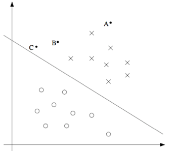
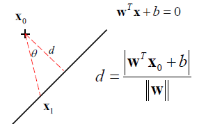
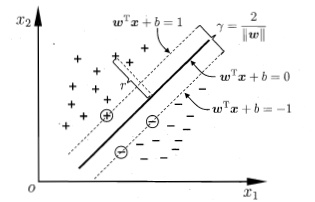
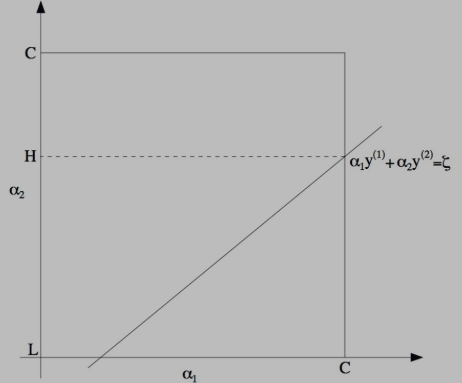
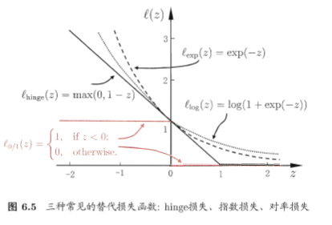
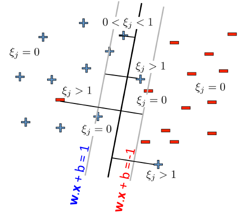
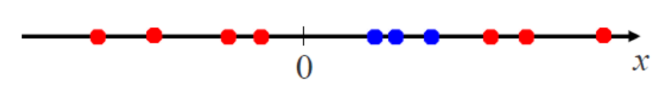
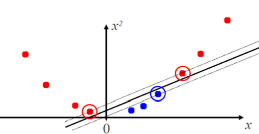

## 支持向量机 Support Vector Machine

### 定义

#### 置信度

当一个数据点离分类超平面(separating hyperplane)越远，就说对给出的预测约有信息，其置信度越高。

#### 函数边间隔

对于一个二分类问题，假定把$Y$分为正类和负类，有：
$$
y \in\{-1,1\}
$$
使用参数$w$和$b$来表示分类器：
$$
y^*=sign\left(w^{T} x+b\right)
$$
则对数据点$\left(x^{(i)}, y^{(i)}\right)​$，函数边界为：

$$
\hat{\gamma}^{(i)}=y^{(i)}\left(w^{T} x+b\right)
$$
当$y^{(i)}=1$ 则$(w^{T} x+b)$作为一个很大的正数， $y^{(i)}=-1$时，作为一个很大的负数，此时，函数间隔很大。

由于函数间隔是一个相对值，即当一个分类器为：
$$
sign\left(2 w^{T} x+2 b\right)
$$
此时所有数据点的函数边界符号不变，只增加了幅度。

使用归一化条件
$$
\|w\|_{2}=1
$$
即将任意分类器缩放为：
$$
sign\left( (\dfrac{w}{||w||_2})^{T} x+ (\dfrac{b}{||w||_2})\right)
$$
不会改变分类器的相对函数间隔

对整个训练数据集，定义其函数间隔为所有训练数据函数间隔的最小值：
$$
\hat{\gamma}=\min _{i=1, \ldots, m} \hat{\gamma}^{(i)}
$$

#### 几何间隔 置信度

（置信度）即数据点$x^{(i)}$到分类超平面$$ 
w^{T} x+b=0
 $$的距离

$$
\begin{aligned} 
\gamma^{(i)} &=\left\|x^{(i)}-x_{1}\right\| \cos \theta \\ &=\frac{\left\|x^{(i)}-x_{1}\right\|\|\mathbf{w}\| \cos \theta}{\|\mathbf{w}\|} \\
&=\frac{\left|\mathbf{w}^{T}\left(x^{(i)}-\mathbf{x}_{1}\right)\right|}{\|\mathbf{w}\|} \\ &=\frac{\left|\mathbf{w}^{T} x^{(i)}-\mathbf{w}^{T} \mathbf{x}_{1}\right.}{\|\mathbf{w}\|} \\ &=\frac{\left|\mathbf{w}^{T} x^{(i)}+b\right|}{\|\mathbf{w}\|}\\
&=y^{(i)}\left(\left(\frac{w}{\|w\|}\right)^{T} x^{(i)}+\frac{b}{\|w\|}\right)

\end{aligned}
$$
对函数间隔和几何间隔，有：
$$
\begin{aligned} \gamma_{1} &=\frac{\hat{\gamma}_{i}}{\|w\|} \\ \gamma &=\frac{\hat{\gamma}}{\|w\|} \end{aligned}
$$
当$\|w\|_{2}=1​$时，几何间隔（置信度）等于函数间隔。

对一个数据集，几何间隔为数据点中函数边界最小值：
$$
\gamma=\min _{i=1, \ldots, m} \gamma^{(i)}
$$

#### 最优边界分类器 optimal margin classifier

找到最优边界分类器，即找到使得几何边界最大的分类器
$$
\begin{array}{c}{\max _{\hat{\gamma}, w, b} \quad \dfrac{\hat{\gamma}}{\|w\|}} \\ {\text { s.t. } y^{(i)}\left(w^{T} x^{(i)}+b\right) \geq \hat{\gamma}, \quad i=1, \ldots, m}\end{array}
$$
引入缩放约束条件，使得函数边界为1（函数边界中缩放$\hat{\gamma}$和缩放$w​$一样不改变相对值）
$$
\hat{\gamma}=1
$$
即：
$$
y^{(i)}\left(\boldsymbol{w}^{\mathrm{T}} \boldsymbol{x}^{(i)}+b\right) \geqslant 1
$$

等价于
$$
\left\{\begin{array}{l}{\boldsymbol{w}^{\mathrm{T}} \boldsymbol{x}^{(i)}+b \geqslant+1, \quad y^{(i)}=+1} \\ {\boldsymbol{w}^{\mathrm{T}} \boldsymbol{x}^{(i)}+b \leqslant-1, \quad y^{(i)}=-1}\end{array}\right.
$$
此时正好使得$\hat{\gamma}^{(i)}=y^{(i)}\left(w^{T} x+b\right)=1$的数据点称为支持向量support vector。

两个异类支持向量到超平面的距离之和称为间隔 margin

间隔的值为$\dfrac{2}{\|\boldsymbol{w}\|}$ 

则几何边界最大的分类器就是间隔最大的分类器，即：
$$
\begin{array}{l}{\max _{w, b} \dfrac{2}{\|\boldsymbol{w}\|}} \\ {\text { s.t. } y^{(i)}\left(\boldsymbol{w}^{\mathrm{T}} \boldsymbol{x}^{(i)}+b\right) \geqslant 1, \quad i=1,2, \ldots, m}\end{array}
$$
为了将问题转为凸优化，转为：
$$
\begin{array}{l}{\min _{w, b} \dfrac{1}{2}\|\boldsymbol{w}\|^{2}} \\ {\text { s.t. } y^{(i)}\left(\boldsymbol{w}^{\mathrm{T}} \boldsymbol{x}^{(i)}+b\right) \geqslant 1, \quad i=1,2, \ldots, m}\end{array}
$$

### 优化  拉格朗日对偶性

>>> >部分内容见 优化/拉格朗日乘子法.md

使用拉格朗日乘子法优化上式：
$$
\begin{aligned} \min _{w, b} & \frac{1}{2}\|w\|^{2} \\ \text {s.t.} & g_{i}(w)=-y^{(i)}\left(w^{T} x^{(i)}+b\right)+1 \leq 0, \quad i=1, \ldots, m \end{aligned}
$$

#### 拉格朗日函数

其拉格朗日函数为：
$$
L(w, b, \alpha)=\frac{1}{2}\|w\|^{2}-\sum_{i=1}^{m} \alpha_{i}\left[y^{(i)}\left(w^{T} x^{(i)}+b\right)-1\right]
$$

#### 对偶问题

把拉格朗日函数分别为$w$和$b$求导，把条件代入，得到对偶条件

对$w$求导：
$$
\nabla_{W} L(w, b, \alpha)=w-\sum_{i=1}^{m} \alpha_{i} y^{(i)} x^{(i)}=0
$$
得到：
$$
w=\sum_{i=1}^{m} \alpha_{i} y^{(i)} x^{(i)}
$$
对$b​$求导：
$$
\frac{\partial}{\partial b} L(w, b, \alpha)=\sum_{i=1}^{m} \alpha_{i} y^{(i)}=0
$$
代入拉格朗日函数：
$$
\begin{aligned}
\theta_D(\alpha)&=\min _{w,b}L(w, b, \alpha)\\
&=\min _{w,b}\frac{1}{2}\|w\|^{2}-\sum_{i=1}^{m} \alpha_{i}\left[y^{(i)}\left(w^{T} x^{(i)}+b\right)-1\right]\\
&=\frac{1}{2}\sum_{i=1}^{m} \alpha_{i} y^{(i)} (x^{(i)})^T \sum_{j=1}^{m} \alpha_{j} y^{(j)} x^{(j)}- \sum_{i=1}^{m} \alpha_{i} y^{(i)} (x^{(i)})^T \sum_{j=1}^{m} \alpha_{j} y^{(j)} x^{(j)}-b \sum_{i=1}^{m} \alpha_{i} y^{(i)}+ \sum_{i=1}^{m} \alpha_{i}     \\
&=\sum_{i=1}^{m} \alpha_{i}-\frac{1}{2} \sum_{i, j=1}^{m} y^{(i)} y^{(j)} \alpha_{i} \alpha_{j}\left(x^{(i)}\right)^{T} x^{(j)}-b \sum_{i=1}^{m} \alpha_{i} y^{(i)}\\
&=\sum_{i=1}^{m} \alpha_{i}-\frac{1}{2} \sum_{i=1}^{m}\sum_{j=1}^{m} y^{(i)} y^{(j)} \alpha_{i} \alpha_{j}\left(x^{(i)}\right)^{T} x^{(j)}
\end{aligned}
$$

得到求偶问题
$$
\max _{\alpha} \theta_D(\alpha)=\sum_{i=1}^{m} \alpha_{i}-\dfrac{1}{2} \sum_{i=1}^{m}\sum_{j=1}^{m} y^{(i)} y^{(j)} \alpha_{i} \alpha_{j}\left\langle x^{(i)} x^{(j)}\right\rangle \\
\alpha_{i} \geq 0, \quad i=1, \ldots, m \\
\sum_{i=1}^{m} \alpha_{i} y^{(i)}=0
$$
有KKT条件：
$$
\left\{\begin{array}{l}{\alpha_{i} \geqslant 0} \\ {y_{i} f\left(x_{i}\right)-1 \geqslant 0} \\ {\alpha_{i}\left(y_{i} f\left(x_{i}\right)-1\right)=0}\end{array}\right.
$$
由于原问题满足Slater条件，$p^*=d^*​$,于是将原问题转为了一个关于$\alpha​$的优化问题。

#### 优化对偶问题  SMO算法 

为了解关于$\alpha$的优化问题，可以使用SMO算法，一种基于坐标上升的方法。

##### 坐标上升 Coordinate ascent 

见  /优化/坐标上升.md

##### SMO

由于$\sum_{i=1}^{m} \alpha_{i} y^{(i)}=0$导致不能仅仅优化一个参数，因为任意单个参数都被其他参数所完全确定，于是一次优化两个参数。

- 选取一对优化的参数$\alpha_i$ 和$\alpha_j$
- 固定其他参数，优化$\max _{\boldsymbol{\alpha}} \sum_{i=1}^{m} \alpha_{i}-\frac{1}{2} \sum_{i=1}^{m} \sum_{j=1}^{m} \alpha_{i} \alpha_{j} y_{i} y_{j} \boldsymbol{x}_{i}^{\mathrm{T}} \boldsymbol{x}_{j}​$得到更新

优化可以写成
$$
\alpha_{i} y_{i}+\alpha_{j} y_{j}=c,          \\ C\geqslant\alpha_{i} \geqslant 0, \quad C \geqslant\alpha_{j} \geqslant 0
$$
其中
$$
c=-\sum_{k \neq i, j} \alpha_{k} y_{k}
$$
则优化问题可以看做

使用$\alpha_{i} y_{i}+\alpha_{j} y_{j}=c$消去一个参数，代入$\max _{\boldsymbol{\alpha}} \sum_{i=1}^{m} \alpha_{i}-\frac{1}{2} \sum_{i=1}^{m} \sum_{j=1}^{m} \alpha_{i} \alpha_{j} y_{i} y_{j} \boldsymbol{x}_{i}^{\mathrm{T}} \boldsymbol{x}_{j}$ 得到单变量的二次规划问题（即只是一个二次函数）。

#### 得到主问题答案

解出$\alpha$后，使用$w=\sum_{i=1}^{m} \alpha_{i} y^{(i)} x^{(i)}$，得到$w$的值。

注意到只有支持向量满足$y^{(i)}\left(w^{T} x+b\right)-1=0$，根据KKT条件的对偶互补条件(dual complementarity condition) $\alpha_{i}\left(y_{i} f\left(x_{i}\right)-1\right)=0$ ，只有支持向量可以使得$\alpha_i \neq 0$，所以在式子$w=\sum_{i=1}^{m} \alpha_{i} y^{(i)} x^{(i)}$中，做出贡献的只有支持向量。

即在训练完成后，大部分训练样本不需要保留，最终模型仅仅和支持向量有关。

对于偏移项$b$，注意到对支持向量有$y_{s} f\left(\boldsymbol{x}_{s}\right)=1$ 即：
$$
y_{s}\left(\sum_{i \in S} \alpha_{i} y_{i} x_{i}^{\mathrm{T}} x_{s}+b\right)=1 \\

b=y_{s}-\sum_{i \in S} \alpha_{i} y_{i} \boldsymbol{x}_{i}^{\mathrm{T}} \boldsymbol{x}_{s}(由于|y_s|=1)
$$
其中$S​$为所有支持向量的集合。

所以通过一个支持向量即可求得$b$，更为Robust的方法是求平均值
$$
b=\frac{1}{|S|} \sum_{s \in S}\left(y_{s}-\sum_{i \in S} \alpha_{i} y_{i} \boldsymbol{x}_{i}^{\mathrm{T}} \boldsymbol{x}_{s}\right)
$$

#### 使用拉格朗日对偶求解优化的原因

1. 由互补对偶条件，引出了支持向量的概念，证明了SVM的稀疏性

2. 引入参数$\alpha$ 得到了决策函数关于$\alpha$的表达式，其中数据点$x​$只以内积形式出现，从而可以引入核函数。

3. 对于决策式$y^*=sign\left(w^{T} x+b\right)$参数$w$可以看做对每个特征的权重.

   又对于决策式$y^{*}=\operatorname{sign}\left(\sum_{i \in S V} \alpha_{i} y_{i}\left(x_{i}^{T} z\right)+b\right)$ 则参数$\alpha$可以看做对每个数据点的权重.

   在特征维度较高，甚至多于数据点时，求解对偶问题更快。

### 软间隔 soft margin SVM 

#### 目的

1.处理样本非线性可分的情况

2.对线性可分的情况，使得模型泛化能力更强

1. 牺牲少部分点，换取更宽的边界，更强的泛化能力
2. 对原本线性可分但由于噪声非线性可分的数据除去噪声

#### 定义

允许某些样本不满足
$$
y_{i}\left(\boldsymbol{w}^{\mathrm{T}} \boldsymbol{x}_{i}+b\right) \geqslant 1
$$

#### 损失函数

使用损失函数度量不满足条件样本造成的影响。

##### 0/1损失

$$
\ell_{0 / 1}(z)=\left\{\begin{array}{ll}{1,} & {\text { if } z<0} \\ {0,} & {\text { otherwise }}\end{array}\right.
$$

此时目标函数为：
$$
\min _{w, b} \frac{1}{2}\|w\|^{2}+C \sum_{i=1}^{m} \ell_{0 / 1}\left(y_{i}\left(w^{\mathrm{T}} x_{i}+b\right)-1\right)
$$
当$C$趋于无穷，软间隔退化为硬间隔。

0/1损失非凸，不连续，于是采用其他损失函数代替。

##### Hinge损失

$$
\ell_{\text {hinge}}(z)=\max (0,1-z)
$$

目标函数
$$
\min _{\boldsymbol{w}, b} \frac{1}{2}\|\boldsymbol{w}\|^{2}+C \sum_{i=1}^{m} \max \left(0,1-y_{i}\left(\boldsymbol{w}^{\mathrm{T}} \boldsymbol{x}_{i}+b\right)\right)
$$

##### 松弛变量 slack variable

改写Hinge loss为：
$$
\min _{\boldsymbol{w}, b, \xi_{i}} \frac{1}{2}\|\boldsymbol{w}\|^{2}+C \sum_{i=1}^{m} \xi_{i} \\
\begin{array}{c}{\text { s.t. } y_{i}\left(\boldsymbol{w}^{\mathrm{T}} \boldsymbol{x}_{i}+b\right) \geqslant 1-\xi_{i}} \\ {\xi_{i} \geqslant 0, i=1,2, \ldots, m}\end{array}
$$
注意到根据松弛变量的不同值，对应对数据点分类的不同情况：

- $\xi=0$ 硬间隔
- $0<\xi<1$ 样本分类正确，但落在最大分类间隔内
- $0<\xi <1$ 依然分类正确，落在间隔内
- $\xi>1​$ 分类错误

##### 指数损失 exponential loss

$$
\ell_{e x p}(z)=\exp (-z)
$$

##### 对率损失 logistic loss

$$
\ell_{\log }(z)=\log (1+\exp (-z))
$$

目标函数
$$
\min _{\boldsymbol{w}, b} \frac{1}{2}\|\boldsymbol{w}\|^{2}+C \sum_{i=1}^{m}\log \left(1+e^{-\left(\mathbf{w} \cdot x_{j}+b\right) y_{j}}\right)
$$
可以看到和RL+L2正则化非常类似

##### SVM与LR的区别

- LR优势为其输出具有自然地概率意义，预测同时给出了概率，SVM不具有概率意义
- LR可以直接应用于多分类，SVM需要推广 
- Hinge loss下由于有一块零区域，使得解有稀疏性，存在支持向量，此时只需要使用支持向量训练，减少了训练样本
- LR和log loss SVM损失函数光滑，没有稀疏性依赖，不能导出支持向量，需要更多训练样本，预测开销更大

##### 结构风险 经验风险 

将损失函数抽象：
$$
\min _{f} \Omega(f)+C \sum_{i=1}^{m} \ell\left(f\left(\boldsymbol{x}_{i}\right), y_{i}\right).
$$
第一项称为结构风险，描述模型的性质，引入了领域知识和用户意图

​	同时降低了训练误差的过拟合风险，又称正则化项。

第二项称为经验风险，描述模型与训练数据的契合程度

#### 优化Hinge Loss软间隔SVM

##### 拉格朗日函数

$$
\begin{aligned} L(\boldsymbol{w}, b, \boldsymbol{\alpha}, \boldsymbol{\xi}, \boldsymbol{\mu})=& \frac{1}{2}\|\boldsymbol{w}\|^{2}+C \sum_{i=1}^{m} \xi_{i} \\ &+\sum_{i=1}^{m} \alpha_{i}\left(1-\xi_{i}-y_{i}\left(\boldsymbol{w}^{\mathrm{T}} \boldsymbol{x}_{i}+b\right)\right)-\sum_{i=1}^{m} \mu_{i} \xi_{i} \end{aligned}
$$

其中$a_i \geq 0, \mu_i \geq 0$ 

##### 对偶问题

拉格朗日函数对$w,b,\xi$求偏导为0，得：
$$
\begin{aligned} w &=\sum_{i=1}^{m} \alpha_{i} y_{i} x_{i} \\ 0 &=\sum_{i=1}^{m} \alpha_{i} y_{i} \\ C &=\alpha_{i}+\mu_{i} \end{aligned}
$$
代入拉格朗日函数  对偶问题为：
$$
\begin{array}{l}{\max _{\boldsymbol{\alpha}} \sum_{i=1}^{m} \alpha_{i}-\frac{1}{2} \sum_{i=1}^{m} \sum_{j=1}^{m} \alpha_{i} \alpha_{j} y_{i} y_{j} x_{i}^{\mathrm{T}} x_{j}} \\ {\text { s.t. } \sum_{i=1}^{m} \alpha_{i} y_{i}=0} \\ {0 \leqslant \alpha_{i} \leqslant C, \quad i=1,2, \ldots, m}\end{array}
$$
唯一的差别为$0\leq \alpha_i \leq C$ (由$C =\alpha_{i}+\mu_{i}$)

同时满足KKT条件：
$$
\left\{\begin{array}{l}{\alpha_{i} \geqslant 0, \quad \mu_{i} \geqslant 0} \\ {y_{i} f\left(x_{i}\right)-1+\xi_{i} \geqslant 0} \\ {\alpha_{i}\left(y_{i} f\left(x_{i}\right)-1+\xi_{i}\right)=0} \\ {\xi_{i} \geqslant 0, \mu_{i} \xi_{i}=0}\end{array}\right.
$$
当样本满足$y_{i} f\left(\boldsymbol{x}_{i}\right)=1-\xi_{i}$ ，此时$\alpha_i \neq 0$ ，称样本为支持向量。

- 当$\alpha_i<C​$ 有$\mu >0​$ 有$\xi_i=0​$ 样本在最大分类间隔上
- $\alpha_i=C$  有$\xi_i\leq$1 落在最大分类间隔内部 

### 决策 

之前得到
$$
w=\sum_{i=1}^{m} \alpha_{i} y^{(i)} x^{(i)}
$$
则在决策时，对于输入数据$z$，求假设函数，当为正则分类为1，为负则分类为0：
$$
w^{T} z+b=\sum_{i \in S V} \alpha_{i} y_{i}\left(x_{i}^{T} z\right)+b
$$
注意到该式子的形式为所有支持向量和输入数据内积的加权和，有：
$$
y^{*}=\operatorname{sign}\left(\sum_{i \in S V} \alpha_{i} y_{i}\left(x_{i}^{T} z\right)+b\right)
$$
决策值取决于很小一部分数据点，作为一种稀疏表示，可以看做一种使用kNN的数据压缩。

#### 支持向量

在线性可分的情况下，有效的支持向量数$|S| \leq m+1$

 $m$为特征数

多余$m+1$个的支持向量对于分割没有决定作用。

想象2维的情况，其中3个点确定2条平行直线。

### 核函数

#### 升维 特征映射 

当数据在特征空间非线性可分的时候，SVM很难正确的给出分类。

当将低维空间的非线性可分数据$x$映射到高维空间，总存在一种映射$\phi(x)$使得其在高维空间中线性可分。

低维：

高维：

当将$x$映射到$\phi(x)$后，对SVM的决策函数有：

$$
f(\boldsymbol{x})=\boldsymbol{w}^{\mathrm{T}} \phi(\boldsymbol{x})+b
$$
优化如下式子：

$$
\begin{array}{l}{\min _{\boldsymbol{w}, b} \frac{1}{2}\|\boldsymbol{w}\|^{2}} \\ {\text { s.t. } y_{i}\left(\boldsymbol{w}^{\mathrm{T}} \boldsymbol{\phi}\left(\boldsymbol{x}_{i}\right)+b\right) \geqslant 1, \quad i=1,2, \ldots, m}\end{array}
$$
对偶问题为：
$$
\max _{\alpha} \sum_{i=1}^{m} \alpha_{i}-\frac{1}{2} \sum_{i=1}^{m} \sum_{j=1}^{m} \alpha_{i} \alpha_{j} y_{i} y_{j} \phi\left(\boldsymbol{x}_{i}\right)^{\mathrm{T}} \phi\left(\boldsymbol{x}_{j}\right)
$$

#### 核函数

由于维数较高（甚至可能无穷）直接计算$\phi\left(\boldsymbol{x}_{i}\right)^{\mathrm{T}} \phi\left(\boldsymbol{x}_{j}\right)$ 非常困难，假设一个函数可以满足：
$$
K(x_i,x_j)=\phi\left(\boldsymbol{x}_{i}\right)^{\mathrm{T}} \phi\left(\boldsymbol{x}_{j}\right)
$$
那么就能省去计算提升到高维的步骤，直接计算内积。，甚至不需要知道映射$\phi(x)$本身，只需要知道映射之后的内积即可，这样的函数成为核函数

采用核函数之后，对偶问题为

$$
\max _{\alpha} \sum_{i=1}^{m} \alpha_{i}-\frac{1}{2} \sum_{i, j=1}^{m} \alpha_{i} \alpha_{j} y_{i} y_{j} K\left(x_{i}, x_{j}\right)
$$
得到的决策函数为：
$$
y^{*}(z)=\operatorname{sign}\left(\sum_{i \in S V} \alpha_{i} y_{i} K\left(x_{i}, z\right)+b\right)
$$

#### 不同的核函数

##### 线性核

$$
\kappa\left(\boldsymbol{x}_{i}, \boldsymbol{x}_{j}\right)=\boldsymbol{x}_{i}^{\mathrm{T}} \boldsymbol{x}_{j}
$$

##### 多项式核

$$
\kappa\left(\boldsymbol{x}_{i}, \boldsymbol{x}_{j}\right)=\left(\boldsymbol{x}_{i}^{\mathrm{T}} \boldsymbol{x}_{j}+1\right)^{d}
$$

##### 高斯核

$$
\kappa\left(\boldsymbol{x}_{i}, \boldsymbol{x}_{j}\right)=\exp \left(-\frac{\left\|\boldsymbol{x}_{i}-\boldsymbol{x}_{j}\right\|^{2}}{2 \sigma^{2}}\right)
$$

$\sigma$称为高斯核的带宽bandwidth

高斯核对应的映射$\phi(x)$将目标映射到无穷维。

最常用的核函数

##### 拉普拉斯核

$$
\kappa\left(\boldsymbol{x}_{i}, \boldsymbol{x}_{j}\right)=\exp \left(-\frac{\left\|\boldsymbol{x}_{i}-\boldsymbol{x}_{j}\right\|}{\sigma}\right)
$$

##### Sigmoid核

$$
\kappa\left(\boldsymbol{x}_{i}, \boldsymbol{x}_{j}\right)=\tanh \left(\beta \boldsymbol{x}_{i}^{\mathrm{T}} \boldsymbol{x}_{j}+\theta\right)
$$

#### 判定核函数 核矩阵

$\kappa(x_i,x_j)$为对称函数，则其为某个映射的核函数的充要条件为：

对于任意数据$D=\left\{\boldsymbol{x}_{1}, \boldsymbol{x}_{2}, \ldots, \boldsymbol{x}_{m}\right\}$，核矩阵$K$总是半正定 
$$
\mathbf{K}=\left[ \begin{array}{cccc}{\kappa\left(\boldsymbol{x}_{1}, \boldsymbol{x}_{1}\right)} & {\cdots} & {\kappa\left(\boldsymbol{x}_{1}, \boldsymbol{x}_{j}\right)} & {\cdots} & {\kappa\left(\boldsymbol{x}_{1}, \boldsymbol{x}_{m}\right)} \\ {\vdots} & {\ddots} & {\vdots} & {\ddots} & {\vdots} \\ {\kappa\left(\boldsymbol{x}_{i}, \boldsymbol{x}_{1}\right)} & {\cdots} & {\kappa\left(\boldsymbol{x}_{i}, \boldsymbol{x}_{j}\right)} & {\cdots} & {\kappa\left(\boldsymbol{x}_{i}, \boldsymbol{x}_{m}\right)} \\ {\vdots} & {\ddots} & {\vdots} & {\ddots} & {\vdots} \\ {\kappa\left(\boldsymbol{x}_{m}, \boldsymbol{x}_{1}\right)} & {\cdots} & {\kappa\left(\boldsymbol{x}_{m}, \boldsymbol{x}_{j}\right)} & {\cdots} & {\kappa\left(\boldsymbol{x}_{m}, \boldsymbol{x}_{m}\right)}\end{array}\right]
$$
即对于任意$z$，有$z^{T} K z \geq 0$ 

##### 核函数的产生法则

- 两个核函数的线性组合是核函数
- 两个核函数的直积是核函数$\kappa_{1} \otimes \kappa_{2}(\boldsymbol{x}, \boldsymbol{z})=\kappa_{1}(\boldsymbol{x}, \boldsymbol{z}) \kappa_{2}(\boldsymbol{x}, \boldsymbol{z})$
- $\kappa_1$为核函数，对任意$g$，$\kappa(\boldsymbol{x}, \boldsymbol{z})=g(\boldsymbol{x}) \kappa_{1}(\boldsymbol{x}, \boldsymbol{z}) g(\boldsymbol{z})$也是核函数

#### 核函数讨论

核(Kernel)的用法远远不仅限于 SVM 算法当中。具体来说，只要你的学习算法，能够写成仅用输入属性向量的内积来表达的形式，那么就可以通过引入 核K(Kernel)

