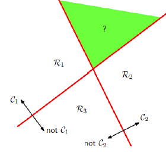

#### 从二分类到多分类扩展

##### One-vs-One

使用的分类器用于两个特定的类之间的判定，每两个类之间都需要一个分类器，一共$(n-1)n/2$个分类器，最后决策时使用所有分类器的投票。

优点：

- 训练时间短，每次训练一个分类器只需要两个类的数据

缺点：

- 存储空间需求多，分类器过多。
- 分类器过多，测试时间长。

##### One-vs-Rest

使用的分类器每个都将一个类和其他类区别开，一共需要$n-1$个分类器

优点：

- 需要的分类器少，存储需求少。
- 测试的时候只需要至多$n-1$次，测试时间多

缺点：

- 训练时间长，由于训练每一个分类器都需要用到所有数据。
- 分类器的正反例不平衡 unbalanced，正例太少，反例太多，分类时容易倾向于反类。