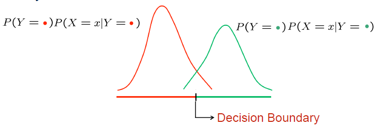
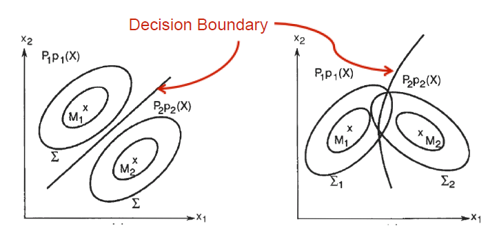

## 贝叶斯分类器 Bayes Classifier

### 定义

对于固定的$x$，贝叶斯分类器选择使得后验概率$P(y|x)$最大的标签$y$作为分类，即：
$$
f^{*}(x)=\arg \max _{Y=y} P(Y=y | X=x)
$$

#### 贝叶斯分类器是最优分类器 Optimal Classification

最小化分类误差的分类器。

对于标签$Y={y_1,y_2, ... , y_N}$ ，将$\lambda_{ij}$记为将标记为$y_j$的样本分类为$y_i$的损失。

##### 条件风险 conditional risk 

将样本$x$分类为$y_i$的期望损失，即条件风险
$$
R(y_i|x)=\sum^{N}_{j=1}\lambda_{ij}P(y_j|x)
$$

##### 总体风险

对于一个分类器 $h:X\rightarrow Y$，总体风险定义为使用该分类器在样本空间中进行分类时产生的条件风险的期望。
$$
R(h)=E_x[R(h(x)|x)]
$$

##### 贝叶斯最优分类器  最小化总体风险

当对每个样本都能最小化条件风险$R(h(x)|x)$，那么总体风险可以最小化。

则贝叶斯最优分类器(Bayes Optimal Classifier)满足：
$$
h^*(x)=\arg\min _{Y=y}R(y|x)
$$
$R(h^*)$称为贝叶斯风险。

-

当损失使用0-1损失时，最小化条件风险等价于最小化分类误差。
$$
\lambda_{i j}=\left\{\begin{array}{ll}{0,} & {\text { if } i=j} \\ {1,} & {\text { otherwise }}\end{array}\right.
$$
此时条件风险为：
$$
R(y | \boldsymbol{x})=\sum^{N}_{j=1}\lambda_{ij}P(y_j|x)=
\sum^{N}_{j=1}P(y_j\neq y|x)=1-P(y | \boldsymbol{x})
$$
所以
$$
f^{*}=\arg \min _{f} P(f(x) \neq Y)
$$

#### 转化后验概率

使用贝叶斯公式，将后验概率转为似然$P(x|y)$，先验$P(y)$和证据$P(x)$。
$$
P(y | \boldsymbol{x})=\frac{P(\boldsymbol{x},y)}{P(\boldsymbol{x})}=\frac{P(\boldsymbol{x}|y)P(y)}{P(\boldsymbol{x})}
$$
对于给定的样本$P(x)$与类标记无关，用于归一化的因子。

所以判别函数可以表示为：
$$
\begin{aligned}
f^{*}(x) 
&=\arg \max _{Y=y} P(Y=y | X=x) \\ 
&=\arg \max _{Y=y} \dfrac{P(X=x | Y=y) P(Y=y)}{P(X=x)} \\
&=\arg \max _{Y=y} P(X=x | Y=y) P(Y=y) 
\end{aligned}
$$

#### 最大化后验的图示

对于高斯分布的似然 
$$
P(X=x | Y=y)=\frac{1}{\sqrt{2 \pi \sigma_{y}^{2}}} \exp \left(-\frac{\left(x-\mu_{y}\right)^{2}}{2 \sigma_{y}^{2}}\right)
$$
若是二分类问题，则两个标签对应的后验概率密度为下图，在左侧选择红色标签，右侧选择绿色（坐标轴为$x$）

对二维高斯分布
$$
P(X=x | Y=y)=\frac{1}{\sqrt{2 \pi\left|\Sigma_{y}\right|}} \exp \left(-\frac{\left(x-\mu_{y}\right) \Sigma_{y}^{-1}\left(x-\mu_{y}^{\prime}\right)}{2}\right)
$$
决策边界是等高线（曲面）的交线

#### 贝叶斯分类器的决策面

http://www.doc88.com/p-1042220839239.html

- 当类间(不同Y条件下X的分布)协方差相等，决策面是直线
- 当类间协方差不相等，类内(X的不同属性的分布)方差相等，决策面为圆
- 当类间协方差不相等，类内方向不等，决策面为椭圆、抛物线、双曲线

- 

### 参数估计

使用最大似然估计，选择参数
$$
\phi_{i |y=1}=p\left(x_{i}=1 | y=1\right)\\
\phi_{i| y=0}=p\left(x_{i}=1 | y=0\right)\\

\phi_{y}=p(y=1)
$$
使得已知数据点出现概率（似然最大）：
$$
P(x,y | \phi_{i |y=1},\phi_{i |y=0},\phi_{y})=\prod_{i} P(x^{(i)},y^{(i)})
$$

### 

