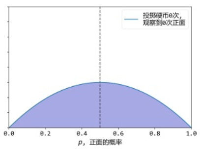
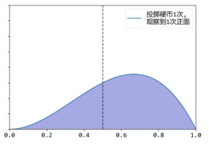
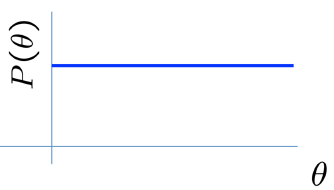
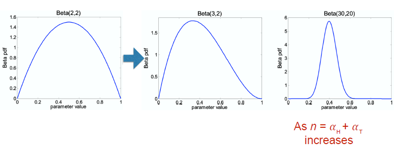

[TOC]

## 最大后验估计 Maximum A Posterior Estimation

##### #估计方法  #贝叶斯派方法  #先验

### 原理

- 首先假定模型参数符合一定的分布$P(\theta)$（比如假设硬币正面的概率满足贝塔分布，概率的概率密度如下，可得概率小于1的概率为1，概率在0.5附近的密度最大，即假设硬币为正面的概率更可能在0.5附近）

  {:height="10px" width="400px"}

  在给定数据$D$的情况下，通过贝叶斯公式，得到模型参数的后验概率（条件概率）（即本来假设硬币正面概率在0.5附近，连抛了10个9个是正面那么原来的假设肯定要修改）
  $$
  P(\theta|D)=\frac{P(D,\theta)}{P(D)}=\frac{P(D|\theta)P(\theta)}{P(D)}
  $$
  则修正以后的模型参数分布为：

  

  最大后验即找到修正之后的模型参数概率分布中最有可能的那个参数，即概率密度最大的那个参数（称为分布的众数mode）。

- 除了假设了模型以外，还假设了模型参数$\theta$的先验$P(\theta)$ ，类似于正则化项，用来约束解空间。

- 比最大似然需要更多的先验知识，对于不同的先验知识$P(\theta)​$，得到的结果不同。

- 随着数据的增加，先验的作用越来越弱，数据的作用越来越强，参数的分布会向着最大似然估计靠拢。

- 当先验分布为均匀分布时，成为MLE。

- 当数据量趋于无穷时，答案和MLE相同。 

### 先验

- 先验分布表示专家知识 expert knowledge

#### 无信息先验 uninformative pirors

均匀分布的先验分布称为无信息先验，此时MAP等同于MLE。

#### 共轭先验 conjugate priors

根据似然的不同分布（即不同模型）都有共轭先验分布与之对应，使得先验$P(\theta)$和后验$P(\theta|D)$形式相同。

##### 贝塔分布 二项分布的共轭先验分布

抛$n=\alpha_ H + \alpha_ T$次硬币，$\alpha _H$次朝上的概率（或称给定模型单次正面的概率$\theta$ 的似然）满足二项分布，数据点$D$不在意顺序 只统计次数。
$$
P(\mathcal{D} | \theta)=\left( \begin{array}{c}{n} \\ {\alpha_{H}}\end{array}\right) \theta^{\alpha_{H}}(1-\theta)^{\alpha_{T}}
$$
当先验满足贝塔分布（即抛一次硬币正面朝上的概率的分布）
$$
P(\theta)=\frac{\theta^{\beta_{H}-1}(1-\theta)^{\beta_{T}-1}}{B\left(\beta_{H}, \beta_{T}\right)} \sim \operatorname{Beta} \left(\beta_{H}, \beta_{T}\right)
$$
则后验分布为
$$
P(\theta | D) \sim \operatorname{Beta}\left(\beta_{H}+\alpha_{H}, \beta_{T}+\alpha_{T}\right)
$$
当代表数据的$\alpha_ H$$\alpha_ T$很大时，$\beta_ H$ $\beta_ T$的影响忽略不计，先验的影响越来越小。

##### 多项分布的共轭分布 狄利克雷分布 Dirichlet 

似然分布
$$
P(\theta | D)=\frac{n !}{\alpha_{1} ! \alpha_{2} ! \ldots \alpha_{k} !} \theta_{1}^{\alpha_{1}} \theta_{2}^{\alpha_{2}} \ldots \theta_{k}^{\alpha_{k}} \quad \sum_{i=1}^{k} \alpha_{i}=n \sum_{i=1}^{k} \theta_{i}=1
$$
先验分布
$$
P(\theta)=\frac{\prod_{i=1}^{k} \theta_{i}^{\beta_{i}-1}}{B\left(\beta_{1}, \ldots, \beta_{k}\right)} \sim \operatorname{Dirichlet}\left(\beta_{1}, \ldots, \beta_{k}\right)
$$
则后验分布
$$
P(\theta | D) \sim \text { Dirichlet }\left(\beta_{1}+\alpha_{1}, \ldots, \beta_{k}+\alpha_{k}\right)
$$

### 抛硬币案例

已经得到抛硬币的后验分布为$ P(\theta | D) \sim \operatorname{Beta}\left(\beta_{H}+\alpha_{H}, \beta_{T}+\alpha_{T}\right)$ 

则最大后验估计取贝塔分布的众数得到
$$
\hat{\theta}_{M A P}=\frac{\alpha_{H}+\beta_{H}-1}{\alpha_{H}+\beta_{H}+\alpha_{T}+\beta_{T}-2}
$$
可见当$\alpha_H \alpha_ T \rightarrow infinity$，$ 
\hat{\theta}_{M L E}=\dfrac{\alpha_{H}}{\alpha_{H}+\alpha_{T}}
 $，和MLE相同。

