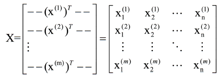
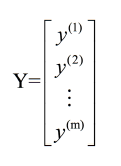

## 线性回归 Linear Regression

### 定义假设

使用线性表达式对$y$进行回归拟合：
$$
h(x)=\theta_{0}+\theta_{1} x_{1}+...+\theta_{n} x_{n}=\sum_{i=0}^{n} \theta_{i} x_{i}=\theta^{T} x
$$
$\theta_0$为截距项intercept term，假设$x_0=1$ 以简化表达式。

### 学习

#### 成本函数 cost function

通过成本函数定义假设函数和真实值的距离。

把均方误差作为成本函数：
$$
J(\theta)=\frac{1}{2} \sum_{i=1}^{m}\left(h_{\theta}\left(x^{(i)}\right)-y^{(i)}\right)^{2}
$$

#### 概率解释 为什么选择LMS作为损失函数

当用线性模型建模输出，假设对每个数据，存在误差$\epsilon$，即
$$
y^{(i)}=\theta^{T} x^{(i)}+\epsilon^{(i)}
$$
作出两个假设：

- 误差服从高斯分布 $\epsilon^{(i)} \sim N\left(0, \sigma^{2}\right)$
- 不同数据点的误差之间独立同分布

此时误差的密度函数
$$
p\left(\epsilon^{(i)}\right)=\frac{1}{\sqrt{2 \pi} \sigma} \exp \left(-\frac{\left(\epsilon^{(i)}\right)^{2}}{2 \sigma^{2}}\right)
$$
由于$y$为误差加估计偏置，所以此时对于固定的数据$X$，$y$服从高斯分布
$$
y^{(i)}\left|x^{(i)} ; \theta \sim\right.N(\theta^Tx^{(i)},\sigma^2)
$$
即：
$$
p\left(y^{(i)} | x^{(i)} ; \theta\right)=\frac{1}{\sqrt{2 \pi} \sigma} \exp \left(-\frac{\left(y^{(i)}-\theta^{T} x^{(i)}\right)^{2}}{2 \sigma^{2}}\right)
$$
对于当前数据集$(X,y)$ 给出数据集存在的概率
$$
p(\vec{y} | X ; \theta)
$$
其中设计矩阵$X$

当概率作为$\theta$的函数，被称为似然，表示为：
$$
L(\theta)=L(\theta ; X, \vec{y})=p(\vec{y} | X ; \theta)
$$
做出假设：

- $y^{(i)},x^{(i)}$均独立 

通过极大似然法估计$\theta$ ，给出似然的表示：
$$
\begin{aligned} 
L(\theta) &=p(\vec{y} | X ; \theta) \\
&=\prod_{i=1}^{m} p\left(y^{(i)} | x^{(i)} ; \theta\right) \\ 
&=\prod_{i=1}^{m} \frac{1}{\sqrt{2 \pi} \sigma} \exp \left(-\frac{\left(y^{(i)}-\theta^{T} x^{(i)}\right)^{2}}{2 \sigma^{2}}\right)
\end{aligned}
$$
取对数似然：
$$
\begin{aligned} l(\theta) &=\log L(\theta) \\ &=\log \prod_{i=1}^{m} \frac{1}{\sqrt{2 \pi} \sigma} \exp \left(-\frac{\left(y^{(i)}-\theta^{T} x^{(i)}\right)^{2}}{2 \sigma^{2}}\right) \\ &=\sum_{i=1}^{m} \log \frac{1}{\sqrt{2 \pi \sigma}} \exp \left(-\frac{\left(y^{(i)}-\theta^{T} x^{(i)}\right)^{2}}{2 \sigma^{2}}\right) \\ &=m \log \frac{1}{\sqrt{2 \pi} \sigma}-\frac{1}{\sigma^{2}} \cdot \frac{1}{2} \sum_{i=1}^{m}\left(y^{(i)}-\theta^{T} x^{(i)}\right)^{2} \end{aligned}
$$
发现当均方误差$\frac{1}{2} \sum_{i=1}^{m}\left(y^{(i)}-\theta^{T} x^{(i)}\right)^{2}​$ 最小时，对数似然最大。

即当做出如下假设时，LMS是自然的：

- 线性回归的误差为IID高斯分布
- 通过极大似然法来估计数据出现的概率

此时$y$服从高斯分布。

#### 优化 梯度下降法

使用梯度下降法优化均方误差，称为最小均方算法 Least Mean Square Algorithm.

- 初始化

定义一个猜测初始值 $\theta$ 

- 梯度下降

计算损失函数在$\theta$的梯度，进行更新。

对于某个维度上的参数$\theta_j$ ：
$$
\theta_{j} :=\theta_{j}-\alpha \frac{\partial}{\partial \theta_{j}} J(\theta)
$$

计算梯度：
$$
\begin{aligned} \frac{\partial}{\partial \theta_{j}} J(\theta) &=\frac{\partial}{\partial \theta_{j}} \frac{1}{2}\left(h_{\theta}(x)-y\right)^{2} \\ &=2 \cdot \frac{1}{2}\left(h_{\theta}(x)-y\right) \cdot \frac{\partial}{\partial \theta_{j}}\left(h_{\theta}(x)-y\right) \\ &=\left(h_{\theta}(x)-y\right) \cdot \frac{\partial}{\partial \theta_{j}}\left(\sum_{i=0}^{n} \theta_{i} x_{i}-y\right) \\ &=\left(h_{\theta}(x)-y\right) x_{j} \end{aligned}
$$

---

只有一个样本时，更新为：
$$
\theta_{j} :=\theta_{j}+\alpha\left(y^{(i)}-h_{\theta}\left(x^{(i)}\right)\right) x_{j}^{(i)}
$$
称为**LMS更新规则**，又称**Widrow-Hoff**学习规则。

更新的大小与$(y^{(i)} − h_\theta(x^{(i)}))$成正比

---

有多个样本时，更新为：
$$
\theta_{j} :=\theta_{j}+\alpha \sum_{i=1}^{m}\left(y^{(i)}-h_{\theta}\left(x^{(i)}\right)\right) x_{j}^{(i)}
$$
被称为**批量梯度下降法** batch gradient descent

---

有多个样本时，每次更新不使用所有样本，而是分批使用样本计算梯度
$$
\theta_{j} :=\theta_{j}+\alpha\left(y^{(i)}-h_{\theta}\left(x^{(i)}\right)\right) x_{j}^{(i)}
$$
称为**随机梯度下降法** stochastic gradient descent

---

#### 优化  矩阵形式直接求导 法方程 normal equation

通过求$\nabla_{\theta} J(\theta)=0$ ，得到损失函数最小时的$\theta$ 

- 输入$X$用矩阵表示：

- 输出$y$用向量表示

  

由于$h_{\theta}\left(x^{(i)}\right)= \theta ^T\left(x^{(i)}\right) (定义)= \left(x^{(i)}\right)^{T} \theta$

则：

$$
\begin{aligned} X \theta-\vec{y} &=\left[ \begin{array}{c}{\left(x^{(1)}\right)^{T} \theta} \\ {\vdots} \\ {\left(x^{(m)}\right)^{T} \theta}\end{array}\right]-\left[ \begin{array}{c}{y^{(1)}} \\ {\vdots} \\ {y^{(m)}}\end{array}\right] \\ &=\left[ \begin{array}{c}{h_{\theta}\left(x^{1}\right)-y^{(1)}} \\ {\vdots} \\ {h_{\theta}\left(x^{m}\right)-y^{(m)}}\end{array}\right] \end{aligned}
$$
由于$z^{T} z=\sum_{i} z_{i}^{2}$，所以：
$$
\begin{aligned} \frac{1}{2}(X \theta-\vec{y})^{T}(X \theta-\vec{y}) &=\frac{1}{2} \sum_{i=1}^{m}\left(h_{\theta}\left(x^{(i)}\right)-y^{(i)}\right)^{2} \\ &=J(\theta) \end{aligned}
$$
由于：

$$
\begin{aligned} \nabla_{A^{T}} f(A) &=\left(\nabla_{A} f(A)\right)^{T} \\ \nabla_{A} t r A B A^{T} C &=C A B+C^{T} A B^{T} \end{aligned}
$$
所以：
$$
\nabla_{A^{T}} \operatorname{tr} A B A^{T} C=B^{T} A^{T} C^{T}+B A^{T} C
$$
通过求$\nabla_{\theta} J(\theta)=0$ 可以得到损失函数最小时的$\theta$  

$$
\begin{aligned} 
\nabla_{\theta} J(\theta) 
&=\nabla_{\theta} \frac{1}{2}(X \theta-\vec{y})^{T}(X \theta-\vec{y}) \\ 
&=\frac{1}{2} \nabla_{\theta}\left(\theta^{T} X^{T} X \theta-\theta^{T} X^{T} \vec{y}-\vec{y}^{T} X \theta+\vec{y}^{T} \vec{y}\right)  \\ 
&=\frac{1}{2} \nabla_{\theta} \operatorname{tr}\left(\theta^{T} X^{T} X \theta-\theta^{T} X^{T} \vec{y}-\vec{y}^{T} X \theta+\vec{y}^{T} \vec{y}\right)   & tr(a) = a，当a为实数\\ 
&=\frac{1}{2} \nabla_{\theta}\left(\operatorname{tr} \theta^{T} X^{T} X \theta-2 \operatorname{tr} \vec{y}^{T} X \theta\right)  & t r A=\operatorname{tr} A^{T} \\ 
&=\frac{1}{2}\left(X^{T} X \theta+X^{T} X \theta-2 X^{T} \vec{y}\right) &\nabla_{A} t r (A B) &=B^{T} \\ &=X^{T} X \theta-X^{T} \vec{y} \end{aligned}
$$
第五步运用$\nabla_{A^{T}} \operatorname{tr} A B A^{T} C=B^{T} A^{T} C^{T}+B A^{T} C$， 其中$A^{T}=\theta, B=B^{T}=X^{T} X, C=I$

运用向量矩阵求导公式

$\dfrac{\partial \mathbf{x}^{T} \mathbf{a}}{\partial \mathbf{x}}=\dfrac{\partial \mathbf{a}^{T} \mathbf{x}}{\partial \mathbf{x}}=\mathbf{a}$  以及 $\dfrac{\partial \mathbf{x}^{T} \mathbf{B} \mathbf{x}}{\partial \mathbf{x}}=\left(\mathbf{B}+\mathbf{B}^{T}\right) \mathbf{x}$  可以更快得到答案：
$$
\begin{aligned} 
\nabla_{\theta} J(\theta) 
&=\nabla_{\theta} \frac{1}{2}(X \theta-\vec{y})^{T}(X \theta-\vec{y}) \\ 
&=\frac{1}{2} \nabla_{\theta}\left(\theta^{T} X^{T} X \theta-\theta^{T} X^{T} \vec{y}-\vec{y}^{T} X \theta+\vec{y}^{T} \vec{y}\right)  \\ 
&=\frac{1}{2}((X^TX+X^TX)\theta-2X^T\vec{y}) \\
&=X^TX\theta-X^T\vec{y}
\end{aligned}
$$
得到**法线方程 normal equations**
$$
X^{T} X \theta=X^{T} \vec{y}
$$
解得

$$
\theta=\left(X^{T} X\right)^{-1} X^{T} \vec{y}
$$

#### 优化 非矩阵形式 直接求导

$$
J(\theta)=\dfrac{1}{2}\sum_{i=1}^{m}\left(h_{\theta}\left(x^{(i)}\right)-y^{(i)}\right)^{2}  =\dfrac{1}{2}\sum_{i=1}^{m}\left(\theta^Tx^{(i)}-y^{(i)}\right)^{2}
$$

则
$$
\frac{\partial}{\partial \theta}J(\theta)=\dfrac{1}{2}\sum_{i=1}^{m}2\left(\theta^Tx^{(i)}-y^{(i)}\right)x^{(i)}=0
$$

### 正则化

具体见 正则化.md

#### L2正则化

又称为 Ridge Regression

添加正则化项，此时成本函数为：
$$
\frac{1}{2} \sum_{1}^{m}\left(h_{\theta}\left(x^{(i)}\right)-y^{(i)}\right)^{2}+\frac{\lambda}{2} \theta^{T} \theta
$$
解为：

$$
\theta=\left(\lambda \mathbf{I}+X^{T} X\right)^{-1} X^{T} \vec{y}
$$

#### L1正则化

又称为Lasso Regression
$$
\frac{1}{2} \sum_{1}^{m}\left(h_{\theta}\left(x^{(i)}\right)-y^{(i)}\right)^{2}+\frac{\lambda}{2} \sum_1^n|\theta|
$$

### 两种优化方法比较

- 法方程法可以在有限步得到答案（利用高斯消去），但当数据量大时不好计算
- 梯度下降法在数据量大时更好用

