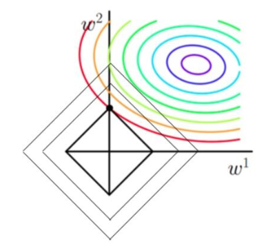
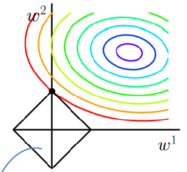
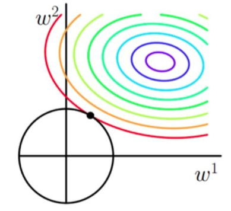

## 正则化 regularization

### 基本形式

$$
\lambda(\sum_{1}^{n}\left|\theta_{j}\right|^{q})^{1/q}
$$

### 正则化的取值

https://www.cnblogs.com/lliuye/p/9354972.html

彩色部分是损失函数的等高线，每个椭圆上损失函数值相同，越接近内部值越小。

黑色为L1正则化项等高线$\left|w_{1}\right|+\left|w_{2}\right| \leqslant t$  ，每个菱形正则化值相同，越接近内部值越小。

目标 

- 参数值在等高线上的圆圈越来越接近中心的紫色圆圈
- 菱形越小越好

对于红色等高线而言，可以作无数个菱形与之相交，而其中与之相切的情况产生的菱形最小。

所以添加了正则化项后，参数的取值一般在**正则化等高线和损失函数等高线的切点处**取到。

### L1正则化

#### 形式

$$
\lambda(\sum_{1}^{n}\left|\theta_{j}\right|)
$$

#### 图示

等高线为$\left|w_{1}\right|+\left|w_{2}\right| \leqslant t$  

#### 性质

正则化等高线和损失函数等高线的切点一般是菱形的顶点，此时一定有某个维度为0，即L1正则化可以剪去不必要的维度。

### L2正则化

#### 形式

$$
\lambda(\sum_{1}^{n}\left|\theta_{j}\right|^{2})^{1/2}
$$

#### 图示

等高线$w_{1}^{2}+w_{2}^{2} \leqslant \mathrm{t}$ 

#### 性质

由于等高线是球，所以切点处不同维度的值相同，所以L2正则化起到平滑作为，让大的值变小，小的值变大。

