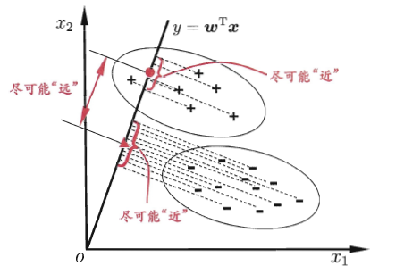
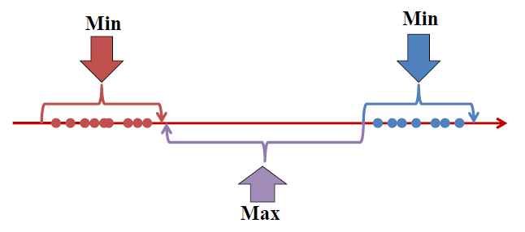

## 线性判别分析 Linear Discriminant Analysis (LDA)

### 定义

分类模型可以被看做一种降维模型，将多维信息投射到一维，到达降维的目的。

投射$y=w^Tx$ ，通过调整$w$的值，选择一个最大化类划分(class separation)的投射方式。

> 为什么$w^Tx$是投影
> $$
> \begin{array}{c}{w^{T} x=<w, x>} \\ {=|w| *|x| * \cos (\theta)} \\ {=|x| * \cos (\theta)}\end{array}
> $$
>  为两个向量的夹角，得到的值为与原点的距离。

LDA是一种监督模型，PCA ICA为无监督模型

通常作为分类前的操作，本身也可以分类

将k维降维成k-1维

#### 投影图示

#### 目的

- 最大化类间差距 between-class scatter

使用均值的差衡量

- 最小化类内差距 within-class scatter

使用协方差 covariance 衡量

### Fisher's LDA  (FLDA)

#### 二分类情况

##### 衡量组间偏差

使用投影后平均值的差 
$$
\begin{aligned}
J2&=
\left\|\hat{\mu}_{0}-\hat{\mu}_{1}\right\|^{2}\\ &= 
\left\|w^T\mu_{0}-w^T\mu_{1}\right\|^{2} \\
&=(w^T\mu_{0}-w^T\mu_{1})(w^T\mu_{0}-w^T\mu_{1})^T\\
&=w^T(\mu_{0}-\mu_{1})(\mu_{0}^Tw-\mu_{1}^Tw) \\
&=w^T(\mu_{0}-\mu_{1})(\mu_{0}-\mu_{1})^Tw \\
&=w^T S_b w
\end{aligned}
$$
其中$S_b=(\mu_{0}-\mu_{1})(\mu_{0}-\mu_{1})^T$ 称为**类间散度矩阵**。

##### 衡量组内偏差

使用与组内均值的距离衡量组内偏差

对于组0中的一个样本$x$，有$\left(w^{T} x-w^{T} \mu_{0}\right)^{2}$ 
$$
\begin{array}{l}{\left(w^{T} x-w^{T} \mu_{0}\right)^{2}=\left(w^{T}\left(x-\mu_{0}\right)\right)^{2}} \\ {=w^{T}\left(x-u_{0}\right)\left(w^{T}\left(x-\mu_{0}\right)\right)^{T}} \\ {=w^{T}\left(x-\mu_{0}\right)\left(x-\mu_{0}\right)^{T} w}\end{array}
$$
组内求和
$$
\sum_{x \in X_{0}}w^T\left(x-u_{0}\right)\left(x-u_{0}\right)^{T}w=
w^T(\sum_{x \in X_{0}}\left(x-u_{0}\right)\left(x-u_{0}\right)^{T})w
$$
其中$\sum_{x \in X_{0}}\left(x-u_{0}\right)\left(x-u_{0}\right)^{T}$ 与组内协方差差一个系数，可以用协方差$\sum_{0}$ 代替。

将两组的偏差求和
$$
\begin{array}{c}{J_{1}=\sum_{x \in X_{0}}\left(w^{T} x-w^{T} u_{0}\right)^{2}+\sum_{x \in X_{1}}\left(w^{T} x-w^{T} u_{1}\right)^{2}} \\ {=\sum_{x \in X_{0}} w^{T}\left(x-u_{1}\right)\left(x-u_{1}\right)^{T} w+\sum_{x \in X_{1}} w^{T}\left(x-u_{1}\right)\left(x-u_{1}\right)^{T} w} \\ {=w^{T} S_{w} w}\end{array}
$$
其中$S_{w}=\sum_{0}+\sum_{1}$ 称为**类内散度矩阵**。

#### 代价函数

最大化类间散度，最小化类内散度
$$
J=\frac{J_{2}}{J_{1}}=\frac{w^{T} S_{b} w}{w^{T} S_{w} w}
$$
称为$S_b$和$S_w$的广义瑞利商 generalized Rayleigh quotient

#### 优化

假设$\boldsymbol{w}^{\mathrm{T}} \mathbf{S}_{w} \boldsymbol{w}=1$ （由于解和$w$的长度无关，只与方向有关）

则优化等价于：
$$
\begin{array}{cl}{\min _{\boldsymbol{w}}} & {-\boldsymbol{w}^{\mathrm{T}} \mathbf{S}_{b} \boldsymbol{w}} \\ {\text { s.t. }} & {\boldsymbol{w}^{\mathrm{T}} \mathbf{S}_{w} \boldsymbol{w}=1}\end{array}
$$
应用拉格朗日乘子法：

得到拉格朗日函数 

$$
L(w,\lambda)=-w^{T} S_{b} w+\lambda\left(w^{T} S_{w} w-1\right)
$$
求解对偶问题，求$\min_{w}L(w,\lambda)$
$$
\begin{aligned}
d L&=-(d w)^{T} S_{b} w-w^{T} d\left(S_{b} w\right)+\lambda(d w)^{T} S_{w} w+\lambda w^{T} d\left(S_{w} w\right) \\
&=-w^{T} S_{b}^{T} d w-w^{T} S_{b} d w+\lambda w^{T} S_{w}^{T} d w+\lambda w^{T} S_{w} d w \\
&=-2 w^{T} S_{b} d w+2 \lambda w^{T} S_{w} d w \\
&=\left(-2 w^{T} S_{b}+2 \lambda w^{T} S_{w}\right) d w
\end{aligned}
$$

$$
\begin{aligned} \frac{\partial L}{\partial w} &=\left(-2 w^{T} S_{b}+2 \lambda w^{T} S_{w}\right)^{T} \\ &=-2 S_{b} w+2 \lambda S_{w} w \\
&= 0 \end{aligned}
$$

得到
$$
S_{b} w=\lambda S_{w} w \\
w=\frac{1}{\lambda} S_{w}^{-1} S_{b} w \\
=\frac{1}{\lambda} S_{w}^{-1}\left(\mu_{1}-\mu_{0}\right)\left(\mu_{1}-\mu_{0}\right)^{T} w
$$
由于只在意方向，除去标量$\dfrac{1}{\lambda}\left(\mu_{1}-\mu_{0}\right)^{T} w ​$ 

解为
$$
\mathbf{w}=\mathbf{S}_{w}^{-1}\left(\boldsymbol{\mu}_{1}-\boldsymbol{\mu}_{0}\right)
$$

#### 多分类情况 Multi-Class FLDA

假设有$N$个分类，每个分类有$m_i$个样本

##### 全局散度矩阵

$$
\begin{aligned} \mathbf{S}_{t} &=\mathbf{S}_{b}+\mathbf{S}_{w} \\ &=\sum_{i=1}^{m}\left(\boldsymbol{x}_{i}-\boldsymbol{\mu}\right)\left(\boldsymbol{x}_{i}-\boldsymbol{\mu}\right)^{\mathrm{T}} \end{aligned}
$$

其中$\mu$为所有样本的均值

##### 类内散度矩阵

定义为每个类别的散度矩阵之和
$$
\mathbf{S}_{w}=\sum_{i=1}^{N} \mathbf{S}_{w_{i}}
$$
其中：

$$
\mathbf{S}_{w_{i}}=\sum_{\boldsymbol{x} \in X_{i}}\left(\boldsymbol{x}-\boldsymbol{\mu}_{i}\right)\left(\boldsymbol{x}-\boldsymbol{\mu}_{i}\right)^{\mathrm{T}}
$$

##### 类间散度矩阵

$$
\begin{aligned} \mathbf{S}_{b} &=\mathbf{S}_{t}-\mathbf{S}_{w} \\ &=\sum_{i=1}^{N} m_{i}\left(\boldsymbol{\mu}_{i}-\boldsymbol{\mu}\right)\left(\boldsymbol{\mu}_{i}-\boldsymbol{\mu}\right)^{\mathrm{T}} \end{aligned}
$$

其中$\mu_i$为每个类的均值

##### 优化目标

优化一个投影矩阵$W$（将k维的X投影到k-1为上）

使得投影：$\mathrm{y}=\mathbf{W}^{\mathrm{T}} \mathbf{x}$ 中统一分类的数据点的距离近

优化对象为：
$$
\max _{\mathbf{W}} \frac{\operatorname{tr}\left(\mathbf{W}^{\mathrm{T}} \mathbf{S}_{b} \mathbf{W}\right)}{\operatorname{tr}\left(\mathbf{W}^{\mathrm{T}} \mathbf{S}_{w} \mathbf{W}\right)}
$$
最终求解：
$$
\mathbf{S}_{b} \mathbf{W}=\lambda \mathbf{S}_{w} \mathbf{W}
$$
