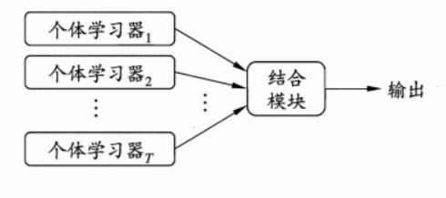

## 集成学习 Ensemble Learning

### 定义

构建多个学习器完成学习任务

又称多分类器系统 multi-classifier system 基于委员会的学习 committee-based learning

产生一组个体学习器 individual learner 使用某种策略结合起来

- 同质 homogeneous 

只包含同种类型的个体学习器（基学习器 base learner）

- 异质 heterogenous 

包含不同类型的个体学习器（组件学习器 component learner）

集成学习掺杂了不同能力的学习器以后，学习能力不是取平均值，如何使学习能力更强

- 由于使用的投票法voting 
- 获得好的集成，个体学习器应有一定准确性，同时有多样性，不同学习器间具有差异。如何产生好而不同的学习器，是集成学习的核心
- 如果假设基学习器之间的误差相互独立，那么随着学习器数目的增大，集成的错误率将指数级下降，最终趋于零。

### 分类

#### 序列化方法

学习器间存在强依赖关系，串行执行

Boosting

#### 并行化方法

学习器间不存在强依赖关系，可同时生成

Bagging 

Random Forest

